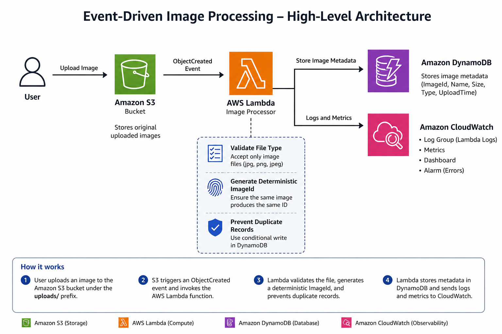

# 📸 Event-Driven Image Processing Pipeline

> A production-inspired serverless application that automatically processes image uploads using AWS event-driven architecture.

---

# 📖 Overview

This project demonstrates how to build a real-world event-driven application on AWS.

Whenever a user uploads an image to Amazon S3, AWS automatically triggers a Lambda function to process the event and store image metadata in Amazon DynamoDB. The entire workflow is serverless, scalable, secure, and fully managed by AWS.

This project is built incrementally to understand not only **how AWS services work**, but also **why they were chosen**, the **design decisions**, **security considerations**, and **implementation trade-offs** behind a production-inspired solution.

---

# 🎯 Project Objectives

- Build an event-driven architecture using AWS services.
- Automatically process uploaded images.
- Store image metadata in a scalable database.
- Follow AWS security best practices.
- Apply least-privilege IAM permissions.
- Document architecture and engineering decisions.
- Showcase a real Cloud Engineering project.

---

# 🏗 Current Architecture

---

# ☁️ AWS Services Used

| Service | Purpose |
|----------|---------|
| Amazon S3 | Store uploaded images and generate events |
| Amazon S3 Event Notifications | Trigger processing automatically |
| AWS Lambda | Process uploaded images |
| Amazon DynamoDB | Store image metadata |
| Amazon CloudWatch | Logging and monitoring |
| AWS IAM | Secure access using least privilege |

---

# 📂 Project Structure

```text
01-event-driven-image-processing/

├── README.md
├── PROJECT_SUMMARY.md
│
├── docs/
│   ├── 01-storage-layer.md
│   ├── 02-event-layer.md
│   └── 03-data-layer.md
│   └── 04-observability-layer.md
│   └── 05-reliability-layer.md
│
├── lambda/
│   └── lambda_function.py
├── screenshots/
│
└── sample-images/
```

---

# 🏛 Architecture & Design

The project is documented by architecture layers instead of individual AWS services.

| Document | Description |
|----------|-------------|
| 01-storage-layer.md | Storage architecture, security decisions, and Amazon S3 implementation |
| 02-event-layer.md | Event-driven processing using Amazon S3 Event Notifications and AWS Lambda |
| 03-data-layer.md | Metadata storage using Amazon DynamoDB and serverless design decisions |
| 04-observability-layer.md | Application monitoring, log retention, Lambda metrics, dashboards, and error detection using Amazon CloudWatch |
| 05-reliability-layer.md | Idempotency, file validation, processing states, structured logging, and resilient error handling |

Each document includes:

- Overview
- Objectives
- Architecture
- Design Decisions
- Implementation Details
- Security Decisions
- Validation
- Lessons Learned
- Challenges
- Future Enhancements
- References

---

# 🚀 Current Features

✅ Secure Amazon S3 Bucket

- Versioning enabled
- Server-side encryption
- Bucket Owner Enforced
- Block Public Access enabled

---

✅ Event-Driven Processing

- Amazon S3 Event Notifications
- AWS Lambda integration
- Prefix filtering
- Automatic invocation

---

✅ Metadata Storage

- Amazon DynamoDB
- UUID-based image identifiers
- On-demand capacity
- Environment variable configuration

---

✅ Security

- Least-Privilege IAM
- Lambda Execution Role
- Resource-Based Policy
- Private S3 Bucket
- Server-side Encryption

---

## ✅ Reliability and Resilience

- Deterministic image identifiers
- Idempotent DynamoDB writes
- Duplicate-event protection
- Supported file-type validation
- Structured JSON logging
- Processing status tracking
- Controlled error handling
- Processing duration measurement

---

# 🧪 Validation Completed

- Amazon S3 bucket created successfully.
- Image uploaded to the `uploads/` prefix.
- AWS Lambda invoked automatically.
- Event data parsed successfully.
- Metadata stored in Amazon DynamoDB.
- CloudWatch Logs verified.
- End-to-end workflow validated.
- Duplicate S3 events safely ignored.
- Unsupported file types rejected.
- Invalid event structures handled.
- Structured processing statuses verified in CloudWatch.
- DynamoDB duplicate records prevented using conditional writes.

---
## 📈 Project Status

| Phase | Status |
|--------|:------:|
| Phase 1: Storage Layer | ✅ Completed |
| Phase 2: Event Layer | ✅ Completed |
| Phase 3: Data Layer | ✅ Completed |
| Phase 4: Observability Layer | ✅ Completed |
| Phase 5: Reliability and Resilience | ✅ Completed |
| Phase 6: Final Documentation and Portfolio | ⏳ Planned |

---

# 🎯 Key Learning Outcomes

This project demonstrates practical experience with:

- Event-Driven Architecture
- Serverless Computing
- Amazon S3
- AWS Lambda
- Amazon DynamoDB
- AWS IAM
- Amazon CloudWatch
- Security Best Practices
- Architecture Design Decisions
- Technical Documentation

---

# 🔮 Planned Enhancements

Future versions of this project will include:

- Amazon SQS for reliable message processing
- Dead Letter Queue (DLQ)
- Amazon EventBridge
- Image validation
- Thumbnail generation
- Processing status tracking
- CloudWatch Alarms
- Infrastructure as Code (Terraform)
- CI/CD Pipeline

---

# 📖 References

- AWS Well-Architected Framework
- Amazon S3 Documentation
- AWS Lambda Documentation
- Amazon DynamoDB Documentation
- AWS IAM Documentation
- Amazon CloudWatch Documentation

---

# 👨‍💻 About This Project

This project is part of my AWS Cloud Engineering learning journey.

Rather than building isolated labs, I am developing production-inspired solutions while documenting the engineering decisions, implementation approach, security considerations, and lessons learned throughout the process.