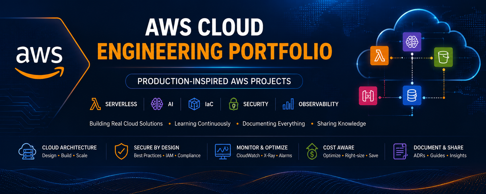

# ☁️ AWS Cloud Engineering Portfolio

  

> A curated collection of production-inspired AWS projects demonstrating cloud architecture, serverless computing, Generative AI, Infrastructure as Code (IaC), security, observability, reliability, and cost optimization.

---

# 🌟 About This Portfolio

Welcome to my AWS Cloud Engineering Portfolio.

This repository showcases production-inspired AWS projects that I built to strengthen my cloud engineering skills through hands-on implementation.

Rather than reproducing isolated tutorials, every project focuses on solving real engineering problems while documenting the architectural decisions, trade-offs, security considerations, monitoring strategy, and AWS best practices behind the solution.

The goal is to build practical, well-documented cloud solutions that reflect how modern applications are designed, deployed, and operated.

---

# 🚀 Featured Projects

| Project | Category | Key Learning Outcomes | AWS Services | Difficulty | Status |
|---------|----------|-----------------------|--------------|:----------:|:------:|
| 🤖 **AWS AI Resume Builder** | AI / Serverless | Build an end-to-end serverless AI application with secure authentication, document processing, and Generative AI | Amazon Cognito, API Gateway, Lambda, S3, Textract, Bedrock, CloudFront, IAM, CloudWatch | ⭐⭐⭐⭐⭐ | ✅ |
| ✨ **Serverless AI CV Enhancer** | AI / Serverless | Build a secure serverless REST API powered by Amazon Bedrock for AI-driven CV enhancement | API Gateway, Lambda, Bedrock, DynamoDB, S3, CloudWatch, X-Ray, IAM | ⭐⭐⭐⭐ | ✅ |
| 📸 **AWS Event-Driven Image Processing** | Event-Driven | Implement an event-driven architecture using Amazon S3 event notifications and AWS Lambda for automated image processing | Amazon S3, Lambda, DynamoDB, CloudWatch | ⭐⭐⭐⭐ | ✅ |
| 🔄 **Serverless DynamoDB CRUD API** | API Development | Design and deploy a scalable RESTful API using AWS Lambda and Amazon DynamoDB | API Gateway, Lambda, DynamoDB | ⭐⭐⭐ | ✅ |
| ⚡ **AWS Lambda Execution Profiler** | Observability | Analyze AWS Lambda execution performance using Amazon CloudWatch metrics, logs, and profiling techniques | Lambda, CloudWatch | ⭐⭐⭐ | ✅ |
| 🌐 **Static Website Hosting on Amazon S3** | Static Hosting | Host and manage a static website using Amazon S3 following AWS best practices | Amazon S3 | ⭐⭐ | ✅ |
| 🏗️ **Three-Tier Web Application** *(Coming Soon)* | Compute & Networking | Build a highly available three-tier web application using EC2, ALB, Auto Scaling, and Amazon RDS | EC2, ALB, Auto Scaling, RDS, VPC | ⭐⭐⭐⭐⭐ | 🚧 |

---

# 📊 Portfolio Snapshot

| Portfolio                            |   Count |
| ------------------------------------ | ------: |
| Production-Inspired AWS Projects     |   **6** |
| AWS Services Used                    |  **8+** |
| Architecture Patterns                |  **5+** |
| Technical Documents                  | **40+** |
| Architecture Decision Records (ADRs) | **14+** |
| Architecture Diagrams                | **30+** |
| Interview Guides                     |   **6** |

> *The portfolio continues to grow with each new project.*

---

# 🛠️ Cloud Engineering Skills

| Domain                 | Technologies                                            |
| ---------------------- | ------------------------------------------------------- |
| Cloud Architecture     | Serverless Architecture, Event-Driven Design, REST APIs |
| Compute                | AWS Lambda                                              |
| Storage                | Amazon S3                                               |
| Database               | Amazon DynamoDB                                         |
| AI / ML                | Amazon Bedrock, Amazon Textract, Prompt Engineering     |
| Monitoring             | Amazon CloudWatch, AWS X-Ray                            |
| Security               | IAM, Least Privilege, CORS                              |
| Programming            | Python                                                  |
| Infrastructure as Code | Terraform *(Learning)*, CloudFormation *(Learning)*     |

📖 Additional technology notes and service summaries are available in the **docs/** directory.

---

# 🗺️ Cloud Engineering Learning Journey

## ✅ Completed

* Static Website Hosting on Amazon S3
* Serverless DynamoDB CRUD API
* AWS Lambda Execution Profiler
* Event-Driven Image Processing
* Serverless AI CV Enhancer
* AWS AI Resume Builder

## 🚧 Currently Building

* Three-Tier Web Application on AWS

## 📌 Planned

* Docker & Amazon ECS
* Amazon EKS
* Amazon VPC
* Infrastructure as Code with Terraform
* AWS CloudFormation
* CI/CD with GitHub Actions
* Amazon EventBridge
* Amazon SNS & Amazon SQS
* Multi-Account AWS Architecture
* Disaster Recovery & High Availability
* Amazon Bedrock Agents
* Amazon Bedrock Knowledge Bases

---

# 📂 Repository Navigation

Every project follows a consistent documentation standard and includes, where applicable:

* Project Overview
* Technical Overview
* Architecture Diagrams
* Architecture Decision Records (ADRs)
* Phase-by-Phase Implementation Guide
* Interview Guide
* Cleanup Guide
* Screenshots
* Source Code

Additional portfolio documentation is available in the **docs/** directory.

| Documentation                    | Description                                              |
| -------------------------------- | -------------------------------------------------------- |
| `docs/CLOUD_SKILLS.md`           | Cloud engineering skills and competency matrix           |
| `docs/AWS_SERVICES.md`           | AWS services covered across projects                     |
| `docs/ENGINEERING_PRINCIPLES.md` | Engineering principles followed throughout the portfolio |
| `docs/LEARNING_ROADMAP.md`       | Detailed cloud learning roadmap                          |
| `docs/REPOSITORY_STRUCTURE.md`   | Repository organization and documentation standards      |

---

# 🎯 Engineering Approach

Every project in this portfolio is designed around production-inspired cloud engineering principles.

These include:

* Security by Design
* AWS Well-Architected Framework
* Reliability & High Availability
* Observability & Monitoring
* Cost-Aware Architecture
* Operational Excellence
* Infrastructure as Code
* Comprehensive Technical Documentation
* Architecture Decision Records (ADRs)

The objective is not simply to demonstrate AWS services, but to explain **why** they were selected and **how** they contribute to a well-architected solution.

---

# 🎯 Mission

My goal is to build a comprehensive collection of production-inspired AWS projects that demonstrate modern cloud engineering practices across serverless architectures, containers, Infrastructure as Code, security, observability, and Generative AI.

Every completed project represents another step toward becoming a well-rounded Cloud Engineer and Solutions Architect.

---

# 🤝 Let's Connect

Thank you for visiting my AWS Cloud Engineering Portfolio.

I'm continuously learning, building, and documenting cloud solutions while sharing my cloud engineering journey with the community.

Feedback, suggestions, and discussions are always welcome.

If you find this repository useful, please consider giving it a ⭐ to support the project.

Happy Learning! 🚀
