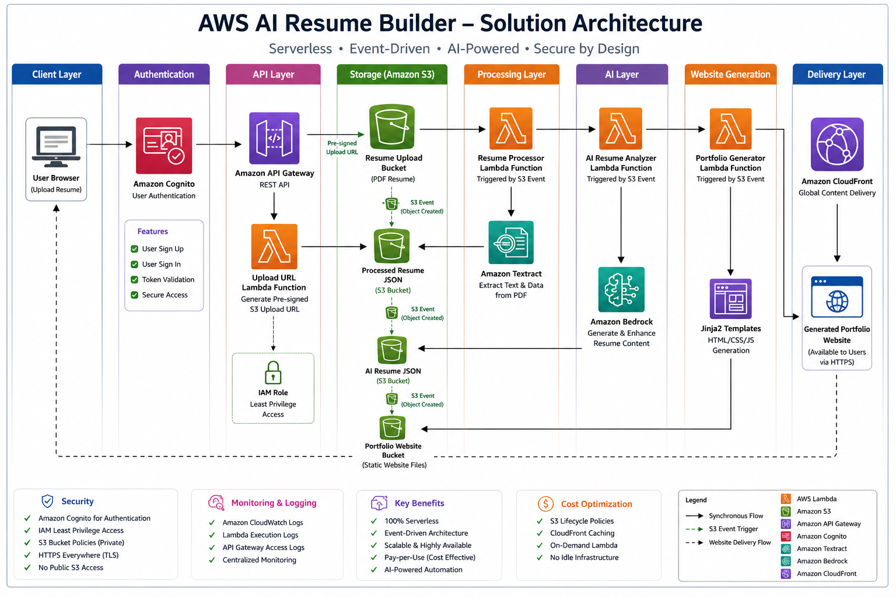
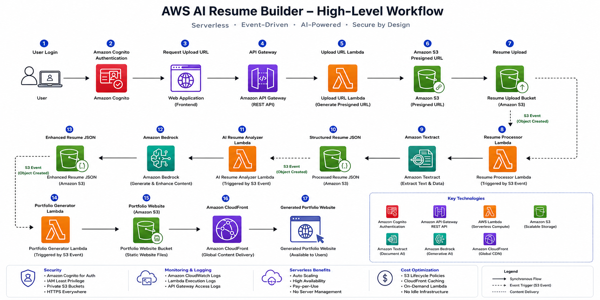

# 🚀 AWS AI Resume Builder

<p align="center">


</p>

---

## 📌 Project Overview

AWS AI Resume Builder is a production-style, serverless application that transforms a PDF resume into a professional portfolio website using AWS AI and serverless technologies.

The application securely accepts resume uploads, extracts content using Amazon Textract, enhances and restructures the information with Amazon Bedrock, and automatically generates a responsive portfolio website that is hosted on Amazon S3 and delivered globally through Amazon CloudFront.

This project demonstrates real-world cloud engineering practices including event-driven architecture, serverless development, secure authentication, infrastructure security, AI integration, and static website hosting.

---

## 🎯 Learning Objectives

This project demonstrates how to:

- Build a complete event-driven serverless application
- Secure applications using Amazon Cognito and IAM
- Upload files securely using Amazon S3 Presigned URLs
- Process documents using Amazon Textract
- Integrate Generative AI using Amazon Bedrock
- Generate static portfolio websites automatically
- Apply AWS Well-Architected Framework principles
- Document architecture using Architecture Decision Records (ADRs)

---

# ✨ Key Features

### User Features

- Secure user authentication
- Resume upload through a web interface
- Direct S3 uploads using Presigned URLs
- Automatic resume processing
- AI-powered resume enhancement
- Responsive portfolio website generation
- Global website delivery using CloudFront

### Cloud Engineering Features

- Event-driven architecture
- Fully serverless design
- Modular Lambda functions
- Least-privilege IAM permissions
- Private S3 buckets
- Structured CloudWatch logging
- Jinja2 template engine
- Production-style documentation
- Architecture Decision Records (ADRs)

---

# 🏗️ Solution Architecture

> **Architecture Diagram**




The application follows an event-driven architecture where each AWS service performs a dedicated responsibility. Resume uploads automatically trigger downstream processing through Amazon S3 events, allowing each component to remain loosely coupled, scalable, and independently maintainable.

---

# 🔄 Application Workflow



---

# ☁️ AWS Services Used

| AWS Service | Purpose |
|-------------|---------|
| AWS Lambda | Serverless compute for business logic |
| Amazon API Gateway | Secure REST API endpoints |
| Amazon S3 | Resume storage, processed data, and portfolio hosting |
| Amazon Cognito | User authentication and authorization |
| Amazon Textract | Extract structured text from PDF resumes |
| Amazon Bedrock | AI-powered resume analysis and content generation |
| Amazon CloudFront | Global delivery of generated portfolio websites |
| Amazon CloudWatch | Logging and operational monitoring |
| AWS IAM | Identity and access management |

---

# 📂 Repository Structure

```text
aws-ai-resume-builder/
│
├── architecture/
│   ├── decisions/
│   └── images/
│
├── docs/
│   ├── phase-01-project-foundation.md
│   ├── phase-02-secure-upload.md
│   ├── phase-03-authentication.md
│   ├── phase-04-resume-processing.md
│   ├── phase-05-ai-resume-analysis.md
│   ├── phase-06-web-client.md
│   ├── phase-07-portfolio-generation.md
│   ├── troubleshooting.md
│   └── cleanup-guide.md
│
├── frontend/
├── lambda/
├── prompts/
├── policies/
├── screenshots/
├── README.md
├── PROJECT_SUMMARY.md
├── INTERVIEW_GUIDE.md
└── LICENSE
```

---

# 📚 Project Documentation

| Document | Description |
|----------|-------------|
| README.md | Project overview and architecture |
| PROJECT_SUMMARY.md | Executive summary |
| INTERVIEW_GUIDE.md | Interview questions and architecture discussion |
| docs/ | Detailed implementation of all project phases |
| architecture/decisions/ | Architecture Decision Records (ADRs) |
| cleanup-guide.md | AWS resource cleanup steps |

---

## 🚀 Project Status

✅ **Completed**

- Phase 1 – Project Foundation & Storage
- Phase 2 – Secure Resume Upload
- Phase 3 – Authentication
- Phase 4 – Resume Processing
- Phase 5 – AI Resume Analysis
- Phase 6 – Web Client Integration
- Phase 7 – Portfolio Website Generation

The project is fully functional and demonstrates a complete end-to-end serverless workflow using AWS managed services.

# 🚀 Implementation Journey

The project was built incrementally using a production-style approach. Each phase introduces a new capability while keeping the application modular, secure, and scalable.

---

# 📦 Phase 1 – Project Foundation & Storage

## Overview

The first phase established the project foundation by creating the storage layer used throughout the application. Amazon S3 was selected as the primary storage service because of its durability, scalability, and seamless integration with AWS serverless services.

This phase also defined the initial repository structure, naming conventions, and folder organization to support future development.

### Objectives

- Create the project repository
- Design the project folder structure
- Create Amazon S3 buckets
- Configure bucket security
- Enable versioning
- Validate file uploads

### Components Implemented

| Component | Purpose |
|-----------|---------|
| Amazon S3 Resume Bucket | Stores uploaded resumes |
| Amazon S3 Processed Data | Stores extracted resume content |
| Amazon S3 AI Output | Stores AI-enhanced resume JSON |
| Amazon S3 Portfolio Bucket | Hosts generated portfolio websites |

### Key Design Decisions

- Separate buckets were used for each processing stage to simplify permissions and troubleshooting.
- S3 Versioning was enabled to protect against accidental deletion or overwrites.
- Public access was blocked on all buckets.
- Bucket names follow a consistent naming convention for easier management.

### Skills Demonstrated

- Amazon S3
- Bucket Policies
- Versioning
- Object Storage
- Security Best Practices

📖 **Detailed documentation:** `docs/phase-01-project-foundation.md`

---

# 🔐 Phase 2 – Secure Resume Upload

## Overview

Uploading files directly through the application server introduces unnecessary complexity and security risks. Instead, this project uses **Amazon S3 Presigned URLs**, allowing authenticated users to upload resumes securely without exposing AWS credentials.

The backend generates a temporary upload URL that grants limited-time permission to upload a single file directly to Amazon S3.

### Workflow

```text
User
    │
    ▼
API Gateway
    │
    ▼
Upload URL Lambda
    │
Generate Presigned URL
    │
    ▼
Amazon S3
```

### Components Implemented

| Component | Purpose |
|-----------|---------|
| Amazon API Gateway | Exposes secure REST endpoint |
| Upload URL Lambda | Generates presigned URLs |
| Amazon S3 | Receives uploaded resumes |

### Security Features

- Temporary upload URLs
- Time-limited access
- Least-privilege IAM permissions
- No AWS credentials exposed to clients
- Direct browser-to-S3 uploads

### Benefits

- Reduced backend workload
- Improved upload performance
- Lower infrastructure costs
- Secure file transfer

### Skills Demonstrated

- Amazon API Gateway
- AWS Lambda
- Amazon S3 Presigned URLs
- IAM Roles
- REST APIs

📖 **Detailed documentation:** `docs/phase-02-secure-upload.md`

---

# 👤 Phase 3 – User Authentication

## Overview

To ensure that only authorized users can upload resumes, Amazon Cognito was integrated into the application. Cognito provides a managed authentication service that eliminates the need to build and maintain a custom identity system.

Authenticated users receive a JSON Web Token (JWT), which is validated by Amazon API Gateway before allowing access to protected API endpoints.

### Authentication Flow

```text
User
    │
    ▼
Amazon Cognito
    │
Authenticate User
    │
    ▼
JWT Access Token
    │
    ▼
Frontend Application
    │
    ▼
Amazon API Gateway
```

### Components Implemented

| Component | Purpose |
|-----------|---------|
| Amazon Cognito User Pool | User registration and authentication |
| Cognito App Client | Frontend authentication |
| API Gateway Authorizer | JWT validation |
| Protected REST APIs | Restrict access to authenticated users |

### Security Features

- Secure user authentication
- JWT token validation
- Protected API endpoints
- Least-privilege IAM permissions
- HTTPS-only communication

### Benefits

- Managed authentication
- No password storage
- Scalable identity management
- Seamless integration with AWS services

### Skills Demonstrated

- Amazon Cognito
- JWT Authentication
- API Gateway Authorization
- Secure API Design
- Identity Management

📖 **Detailed documentation:** `docs/phase-03-authentication.md`

---

# 🤖 Phase 4 – Resume Processing

## Overview

After a resume is uploaded to Amazon S3, an **ObjectCreated** event automatically invokes the Resume Processor Lambda function. The function extracts the uploaded PDF and uses Amazon Textract to convert the document into structured text.

The extracted content is transformed into a structured JSON document and stored in Amazon S3, where it becomes the input for the AI processing stage.

### Workflow

```text
Resume Upload (Amazon S3)
        │
        ▼
S3 ObjectCreated Event
        │
        ▼
Resume Processor Lambda
        │
        ▼
Amazon Textract
        │
        ▼
Structured Resume JSON
        │
        ▼
Amazon S3
```

### Components Implemented

| Component | Purpose |
|-----------|---------|
| Resume Processor Lambda | Processes uploaded resumes |
| Amazon Textract | Extracts text from PDF resumes |
| Amazon S3 | Stores structured resume JSON |

### Key Features

- Event-driven processing
- Automatic document extraction
- Structured JSON generation
- Fully serverless workflow
- No manual intervention

### Skills Demonstrated

- Amazon Textract
- Event-Driven Architecture
- AWS Lambda
- Amazon S3 Events
- JSON Processing

📖 **Detailed documentation:** `docs/phase-04-resume-processing.md`

---

# 🧠 Phase 5 – AI Resume Analysis

## Overview

Once the structured resume JSON is generated, another Amazon S3 event triggers the AI Resume Analyzer Lambda function.

The function sends the extracted resume data to **Amazon Bedrock**, where a foundation model analyzes and restructures the content into a clean, standardized JSON format suitable for portfolio generation.

Instead of generating HTML directly, AI focuses on improving the resume content while keeping presentation logic separate from business logic.

### Workflow

```text
Structured Resume JSON
        │
        ▼
S3 ObjectCreated Event
        │
        ▼
AI Resume Analyzer Lambda
        │
        ▼
Amazon Bedrock
        │
        ▼
Enhanced Resume JSON
        │
        ▼
Amazon S3
```

### Components Implemented

| Component | Purpose |
|-----------|---------|
| AI Resume Analyzer Lambda | Sends resume data to Amazon Bedrock |
| Amazon Bedrock | Enhances and restructures resume content |
| Amazon S3 | Stores AI-generated JSON |

### AI Capabilities

- Resume summarization
- Skill categorization
- Professional profile generation
- Experience normalization
- Consistent JSON output

### Design Decisions

- AI generates structured content rather than HTML.
- Business logic and presentation remain independent.
- Enhanced resume data can be reused by multiple applications.

### Skills Demonstrated

- Amazon Bedrock
- Prompt Engineering
- AWS Lambda
- JSON Transformation
- Generative AI Integration

📖 **Detailed documentation:** `docs/phase-05-ai-resume-analysis.md`

---

# 💻 Phase 6 – Web Client Integration

## Overview

A lightweight web application provides the user interface for authentication and resume uploads.

Authenticated users sign in using Amazon Cognito, request a presigned upload URL, and upload their resume directly to Amazon S3 without routing files through the backend.

This approach minimizes backend processing while improving security and scalability.

### User Workflow

```text
User Login
      │
      ▼
Amazon Cognito
      │
      ▼
Frontend Application
      │
      ▼
API Gateway
      │
      ▼
Upload URL Lambda
      │
      ▼
Amazon S3 Presigned URL
      │
      ▼
Resume Upload
```

### Components Implemented

| Component | Purpose |
|-----------|---------|
| Frontend Application | User interface |
| Amazon Cognito | Authentication |
| Amazon API Gateway | Secure API access |
| Upload URL Lambda | Generates upload URLs |

### Key Features

- Secure authentication
- Direct browser-to-S3 uploads
- Responsive interface
- JWT-based authorization
- REST API integration

### Skills Demonstrated

- HTML
- CSS
- JavaScript
- Amazon Cognito
- API Gateway
- AWS Lambda

📖 **Detailed documentation:** `docs/phase-06-web-client.md`

---

# 🌐 Phase 7 – Portfolio Website Generation

## Overview

The final stage automatically transforms the AI-enhanced resume into a professional static portfolio website.

When the enhanced resume JSON is stored in Amazon S3, an ObjectCreated event triggers the Portfolio Generator Lambda function.

The function renders reusable Jinja2 templates using the AI-generated content and produces a responsive HTML portfolio website.

The generated website is stored in an Amazon S3 bucket and delivered globally using Amazon CloudFront.

### Workflow

```text
Enhanced Resume JSON
        │
        ▼
S3 ObjectCreated Event
        │
        ▼
Portfolio Generator Lambda
        │
        ▼
Jinja2 Templates
        │
        ▼
Portfolio Website (HTML)
        │
        ▼
Amazon S3 Website Bucket
        │
        ▼
Amazon CloudFront
        │
        ▼
Generated Portfolio Website
```

### Components Implemented

| Component | Purpose |
|-----------|---------|
| Portfolio Generator Lambda | Builds HTML portfolio |
| Jinja2 Templates | Dynamic website rendering |
| Amazon S3 | Website hosting |
| Amazon CloudFront | Global content delivery |

### Key Features

- Automatic website generation
- Responsive design
- Static website hosting
- Global CDN delivery
- Fully automated deployment

### Design Decisions

- Separated presentation from AI processing.
- Used reusable Jinja2 templates instead of AI-generated HTML.
- CloudFront provides secure HTTPS delivery and global caching.

### Skills Demonstrated

- Static Website Hosting
- Amazon CloudFront
- AWS Lambda
- Amazon S3
- Jinja2 Templating
- Event-Driven Automation

📖 **Detailed documentation:** `docs/phase-07-portfolio-generation.md`

---


# 🎯 What This Project Demonstrates

This project showcases practical experience with modern AWS cloud engineering and AI services through a production-style implementation.

### AWS Services

- Amazon S3
- AWS Lambda
- Amazon API Gateway
- Amazon Cognito
- Amazon Textract
- Amazon Bedrock
- Amazon CloudFront
- AWS IAM
- Amazon CloudWatch

### Cloud Engineering Skills

- Serverless Architecture
- Event-Driven Design
- REST API Development
- Authentication & Authorization
- AI Integration
- Static Website Hosting
- Secure File Upload
- IAM Security
- Monitoring & Logging
- Production Documentation

# 🔒 Security Architecture

Security was a core consideration throughout the project. The application follows AWS security best practices to protect user data, control access, and minimize the attack surface.

## Security Controls

| Area | Implementation |
|------|----------------|
| Authentication | Amazon Cognito User Pools |
| Authorization | JWT validation using API Gateway |
| Identity & Access | Least-Privilege IAM Roles |
| File Upload | Amazon S3 Presigned URLs |
| Data Storage | Private Amazon S3 Buckets |
| Transport Security | HTTPS/TLS |
| Public Access | Blocked on all S3 buckets |
| Secrets | No hardcoded credentials |

### Security Highlights

- User authentication managed by Amazon Cognito
- Direct browser-to-S3 uploads using temporary presigned URLs
- IAM roles grant only the minimum required permissions
- Private S3 buckets with Block Public Access enabled
- API endpoints protected using JWT authentication
- Server-side encryption supported for stored data

---

# 📊 Monitoring & Logging

The application uses Amazon CloudWatch for centralized monitoring and troubleshooting.

## Logging Strategy

| Service | Logs |
|----------|------|
| Upload URL Lambda | Upload URL generation |
| Resume Processor Lambda | Resume processing |
| AI Resume Analyzer Lambda | AI requests and responses |
| Portfolio Generator Lambda | Website generation |
| API Gateway | Request logs |
| CloudFront | Access logs (optional) |

### Operational Benefits

- Centralized logging
- Easier troubleshooting
- Faster root cause analysis
- Improved operational visibility

---

# 💰 Cost Optimization

The solution was designed using managed, serverless AWS services to minimize operational costs.

## Cost Optimization Techniques

- AWS Lambda scales automatically with demand
- Amazon S3 charges only for stored data
- CloudFront caches static content globally
- No EC2 instances to manage
- No always-on infrastructure
- Event-driven processing eliminates idle resources

### Why Serverless?

- Pay only when functions execute
- Automatic scaling
- Reduced operational overhead
- High availability by default

---

# 🏛️ AWS Well-Architected Framework

This project aligns with the six pillars of the AWS Well-Architected Framework.

| Pillar | Implementation |
|----------|----------------|
| Operational Excellence | Modular Lambda functions, documentation, CloudWatch logging |
| Security | Amazon Cognito, IAM, JWT authentication, private S3 buckets |
| Reliability | Event-driven processing with Amazon S3 triggers |
| Performance Efficiency | Serverless architecture with CloudFront caching |
| Cost Optimization | Pay-per-use services with no idle infrastructure |
| Sustainability | Fully managed AWS services with automatic scaling |

---

# 🎓 Lessons Learned

Building this project provided hands-on experience with designing and operating cloud-native applications.

### Key Takeaways

- Event-driven architectures simplify application workflows.
- Amazon S3 integrates seamlessly with serverless services.
- Presigned URLs provide a secure method for browser-based uploads.
- Amazon Textract significantly reduces document processing effort.
- Amazon Bedrock enables rapid AI integration without managing ML infrastructure.
- Separating AI processing from presentation logic improves maintainability.
- CloudFront enhances website performance through global edge caching.
- Good documentation is just as important as good code.

---

# ⚠️ Challenges & Solutions

| Challenge | Solution |
|-----------|----------|
| Secure file uploads | Implemented Amazon S3 Presigned URLs |
| PDF text extraction | Integrated Amazon Textract |
| AI output consistency | Improved prompts and standardized JSON structure |
| Portfolio generation | Used reusable Jinja2 templates |
| Secure API access | Protected endpoints with Amazon Cognito and JWT |
| Static website delivery | Hosted on Amazon S3 with Amazon CloudFront |

---

# 🧹 Resource Cleanup

To avoid unnecessary AWS charges, resources should be removed after completing the project.

### Recommended Cleanup Order

```text
Disable CloudFront Distribution
        │
        ▼
Remove Amazon S3 Event Notifications
        │
        ▼
Delete Lambda Functions
        │
        ▼
Delete Lambda Layers
        │
        ▼
Empty Amazon S3 Buckets
        │
        ▼
Delete Amazon S3 Buckets
        │
        ▼
Delete API Gateway
        │
        ▼
Delete Amazon Cognito User Pool
        │
        ▼
Delete IAM Roles and Policies
        │
        ▼
Delete CloudWatch Log Groups
```

> 📌 Capture screenshots before deleting AWS resources if you plan to use them in your portfolio.

---

# 📚 Repository Documentation

| Document | Description |
|----------|-------------|
| README.md | Project overview |
| PROJECT_SUMMARY.md | Executive summary |
| INTERVIEW_GUIDE.md | Interview preparation |
| docs/ | Detailed implementation guide |
| architecture/ | Architecture diagrams and ADRs |
| troubleshooting.md | Common issues and resolutions |
| cleanup-guide.md | Resource cleanup instructions |

---

# 🚀 Future Enhancements

Potential enhancements for future iterations include:

- Infrastructure as Code using Terraform
- CI/CD pipeline with GitHub Actions
- Custom domain using Amazon Route 53
- HTTPS certificates with AWS Certificate Manager
- Multiple portfolio themes
- Contact form integration
- DynamoDB for user metadata
- Analytics dashboard for portfolio visits

---

# 🏆 Skills Demonstrated

## AWS Services

- Amazon S3
- AWS Lambda
- Amazon API Gateway
- Amazon Cognito
- Amazon Textract
- Amazon Bedrock
- Amazon CloudFront
- AWS IAM
- Amazon CloudWatch

## Cloud Engineering

- Serverless Architecture
- Event-Driven Design
- REST APIs
- Authentication & Authorization
- Secure File Upload
- AI Integration
- Static Website Hosting
- Logging & Monitoring
- Cost Optimization
- Documentation

---

# 🙏 Acknowledgements

This project was inspired by the **AI Resume Builder** project shared by **Rajesh** from **IaaS Academy**.

Thank you to Rajesh and the IaaS Academy team for creating and sharing this valuable learning project with the community. This repository represents my personal implementation, enhancements, and learning journey while exploring AWS serverless services and Generative AI.

Original project:
https://github.com/iaasacademy/ai-resume-builder-aws

---

# ⭐ Support

If you found this repository helpful, consider giving it a ⭐ on GitHub.

Feedback, suggestions, and contributions are always welcome.

Happy Cloud Learning! ☁️