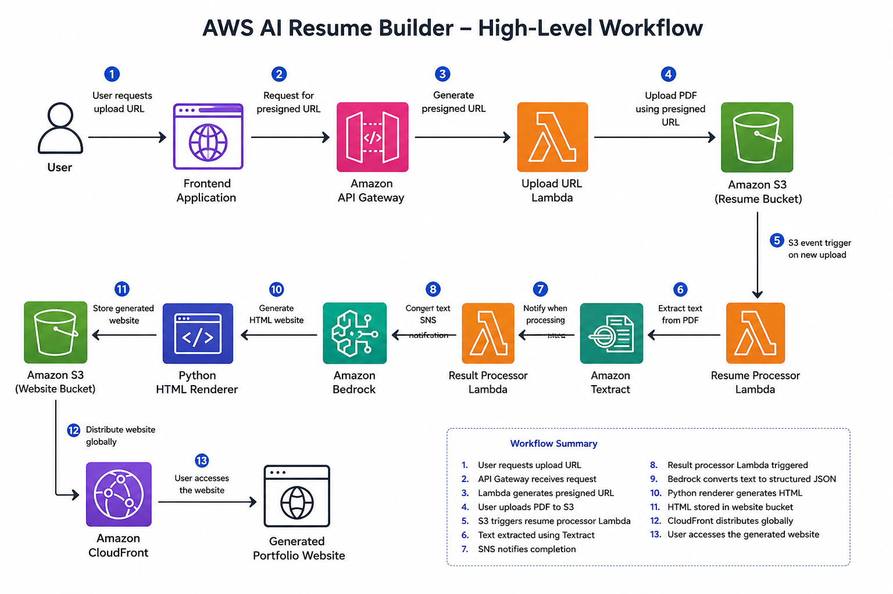

# AWS AI Resume Builder

> **Build Status:** ✅ Phase 5 – AI Resume Analysis Completed

The application currently supports an end-to-end backend workflow from authenticated resume upload to AI-generated structured resume data.

The project does not yet include a graphical user interface. Authentication and resume upload were tested using `curl`.

---

## Project Overview

Recruiters and hiring managers often spend only a short time reviewing a resume. A well-designed personal portfolio website can provide a more engaging way to present professional experience, technical skills, certifications, and projects.

However, building and maintaining a personal website usually requires:

* Web development knowledge
* Manual resume formatting
* HTML and CSS experience
* Hosting configuration
* Ongoing website updates

The AWS AI Resume Builder automates this process.

Users securely upload a resume through a web application. The system authenticates the user, stores the resume in Amazon S3, extracts its content using Amazon Textract, analyzes the extracted information using Amazon Bedrock, and generates a professional static portfolio website.

The solution follows a serverless, event-driven architecture designed around AWS security, scalability, reliability, and cost-efficiency principles.

---

## Problem Statement

Creating a professional portfolio website usually involves several manual steps:

* Organizing resume content
* Writing HTML, CSS, and JavaScript
* Selecting a website layout
* Configuring hosting
* Publishing the website
* Updating the website whenever the resume changes

These tasks can be time-consuming, particularly for users without web development experience.

This project automates the workflow using AWS managed services and generative AI.

---

## Solution Overview

The application provides an automated pipeline that:

* Authenticates users using Amazon Cognito
* Generates secure Amazon S3 presigned upload URLs
* Uploads resumes directly to a private S3 bucket
* Starts resume processing automatically through an S3 event
* Extracts resume text using Amazon Textract
* Converts the extracted content into structured JSON
* Analyzes and restructures resume content using Amazon Bedrock
* Generates a professional static portfolio website
* Stores generated website files in Amazon S3
* Delivers the website through Amazon CloudFront

The result is a scalable, secure, and fully serverless application.

---

## High-Level Architecture





---

## Project Highlights

The solution is designed to demonstrate:

* Fully serverless architecture
* Event-driven document processing
* Secure resume uploads using Amazon S3 presigned URLs
* Private Amazon S3 storage
* Authentication using Amazon Cognito
* JWT-protected API Gateway routes
* Resume text extraction using Amazon Textract
* Structured JSON generation
* AI-powered resume analysis using Amazon Bedrock
* Automated HTML portfolio generation
* Static website delivery using Amazon CloudFront
* Logging and monitoring using Amazon CloudWatch
* Least-privilege IAM permissions
* AWS Well-Architected Framework principles

---

## AWS Services

| Category            | AWS Service        | Purpose                                               | Status |
| :------------------ | :----------------- | :---------------------------------------------------- | :----: |
| Compute             | AWS Lambda         | Run serverless application logic                      | ✅ Implemented |
| Storage             | Amazon S3          | Store resumes, processed JSON, AI output, and website files | ✅ Implemented |
| API                 | Amazon API Gateway | Expose secure application APIs                        | ✅ Implemented |
| Authentication      | Amazon Cognito     | Authenticate users and issue JWT tokens               | ✅ Implemented |
| Document Processing | Amazon Textract    | Extract text from uploaded resumes                    | ✅ Implemented |
| Monitoring          | Amazon CloudWatch  | Collect Lambda logs and operational metrics           | ✅ Implemented |
| Security            | AWS IAM            | Control access between AWS services                   | ✅ Implemented |
| Generative AI       | Amazon Bedrock     | Analyze resume content using Claude Sonnet 4.6 and generate structured JSON | ✅ Implemented |
| Content Delivery    | Amazon CloudFront  | Deliver generated portfolio websites securely         | ⬜ Not Started |

---

## Current Progress

| Phase   | Description                  |     Status    |
| :------ | :--------------------------- | :-----------: |
| Phase 1 | Project Foundation & Storage |   ✅ Complete  |
| Phase 2 | Secure Resume Upload         |   ✅ Complete  |
| Phase 3 | Authentication               |   ✅ Complete  |
| Phase 4 | Resume Processing            |   ✅ Complete  |
| Phase 5 | AI Resume Analysis           |   🚧 Planned  |
| Phase 6 | Portfolio Website Generation | ⬜ Not Started |
| Phase 7 | Production Readiness         | ⬜ Not Started |

---

## Completed So Far

### Phase 1 – Project Foundation & Storage

This phase established the repository foundation and secure storage layer.

Completed activities:

* Created the GitHub repository structure
* Defined the initial project architecture
* Created project documentation
* Established the Architecture Decision Record structure
* Created a private resume upload bucket
* Created a private generated website bucket
* Enabled Block Public Access
* Enabled Bucket Owner Enforced object ownership
* Enabled server-side encryption using SSE-S3
* Configured a lifecycle policy for uploaded resumes
* Enabled versioning for generated website files
* Created a sample resume dataset
* Documented storage design decisions

---

### Phase 2 – Secure Resume Upload

This phase implemented secure browser-based resume uploads.

Completed activities:

* Created an HTTP API using Amazon API Gateway
* Created an Upload URL Generator Lambda function
* Configured Lambda proxy integration
* Generated short-lived Amazon S3 presigned URLs
* Added PDF and DOCX file-type validation
* Added a 5 MB file-size limit
* Generated unique object keys using UUIDs
* Used Lambda environment variables for configuration
* Created a least-privilege Lambda execution role
* Configured API-level CORS
* Uploaded resumes directly to a private S3 bucket
* Completed end-to-end upload validation

The upload architecture prevents AWS credentials from being exposed to the browser and avoids routing large resume files through the Lambda function.

---

### Phase 3 – Authentication

This phase protected the upload API using Amazon Cognito and JWT authorization.

Completed activities:

* Created an Amazon Cognito User Pool
* Created a public application client without a client secret
* Created and confirmed a test user
* Enabled username and password authentication for testing
* Generated Amazon Cognito access tokens
* Created an API Gateway JWT authorizer
* Protected the `POST /upload-url` route
* Verified that unauthenticated requests return `401 Unauthorized`
* Verified that invalid tokens are rejected
* Verified that authenticated requests return a presigned upload URL
* Successfully uploaded a resume after authentication

---

### Phase 4 – Resume Processing

This phase implemented the event-driven document-processing workflow.

Completed activities:

* Configured an Amazon S3 `ObjectCreated` event
* Triggered the Resume Processor Lambda automatically
* Read uploaded resume metadata from the S3 event
* Retrieved resume files from the private S3 bucket
* Integrated the Lambda function with Amazon Textract
* Extracted text from supported resume documents
* Converted Textract output into structured JSON
* Stored processed JSON under the `processed/` prefix
* Added structured application logging
* Added exception handling
* Created least-privilege IAM permissions
* Validated the complete upload-to-processing workflow

The current processing flow is:

```text
Resume Upload
      ↓
Amazon S3
      ↓
ObjectCreated Event
      ↓
Resume Processor Lambda
      ↓
Amazon Textract
      ↓
Structured JSON
      ↓
Processed S3 Location
```

### Phase 4 Troubleshooting

During implementation, several real-world issues were identified and resolved:

* Missing `s3:GetObject` permission
* `InvalidS3ObjectException`
* `UnsupportedDocumentException`
* Amazon Textract access and subscription errors
* Invalid or unsupported test documents

CloudWatch Logs, AWS CLI commands, and the IAM Policy Simulator were used to troubleshoot the issues.

### Phase 5: AI Resume Analysis 

- Created a dedicated AI Resume Analyzer Lambda
- Integrated Claude Sonnet 4.6 through Amazon Bedrock
- Used a Bedrock inference profile for on-demand invocation
- Created controlled resume-extraction prompts
- Added hallucination and prompt-injection protections
- Parsed and validated model-generated JSON
- Stored AI output under a dedicated S3 prefix
- Added CloudWatch operational logging
- Troubleshot Bedrock inference-profile and S3 IAM issues

---

## Current Application Flow

The working application currently supports the following flow:

```text
User Authentication
        ↓
JWT Token
        ↓
Protected Upload API
        ↓
Presigned URL Generation
        ↓
Direct Resume Upload to S3
        ↓
Automatic Lambda Invocation
        ↓
Amazon Textract Processing
        ↓
Structured JSON Stored in S3
```

Amazon Bedrock analysis and website generation will be added in the upcoming phases.

---

## Repository Structure

```text
aws-ai-resume-builder/
│
├── architecture/
│   ├── images/
│   └── decisions/
│
├── docs/
├── frontend/
├── lambda/
│   ├── upload-url-generator/
│   └── resume-processor/
│
├── policies/
├── prompts/
├── sample-resumes/
├── screenshots/
│
├── README.md
├── PROJECT_SUMMARY.md
└── INTERVIEW_GUIDE.md
```

The repository intentionally avoids unnecessary folders and excessive documentation. Each folder contains files that directly support the application, architecture, or portfolio presentation.

---

## Architecture Decision Records

Important architectural decisions are documented as Architecture Decision Records.

Current ADRs include:

* ADR-001 – Use Separate Amazon S3 Buckets
* ADR-002 – Use Different Versioning Strategies
* ADR-003 – Use Amazon S3 Presigned URLs for Secure Resume Uploads
* ADR-004 – Use Amazon Cognito and API Gateway JWT Authorization
* ADR-005 – Use Amazon Textract for Resume Text Extraction

Additional ADRs will be added only when a significant architectural decision requires explanation.

---

## Security Design

The project currently implements the following security controls:

* Private Amazon S3 buckets
* S3 Block Public Access
* Bucket Owner Enforced object ownership
* Server-side encryption
* Short-lived presigned URLs
* File-type validation
* File-size validation
* Amazon Cognito authentication
* JWT-protected API routes
* Least-privilege IAM permissions
* HTTPS communication through AWS managed endpoints
* No AWS credentials exposed to the frontend
* CloudWatch logging for troubleshooting and auditing
* Sanitized test resumes without real personal information

---

## Reliability Design

Current and planned reliability practices include:

* Event-driven processing
* Lambda exception handling
* CloudWatch logging
* S3 lifecycle cleanup
* Unique object keys
* Duplicate-event handling
* Idempotent processing
* Lambda retry review
* Dead-letter queue evaluation
* Bedrock response validation
* CloudWatch alarms
* Operational dashboards

The advanced reliability controls will be completed during the Production Readiness phase.

---

## Cost Considerations

The application uses usage-based AWS managed services.

Primary cost drivers include:

* Amazon S3 storage
* AWS Lambda invocations and execution duration
* Amazon API Gateway requests
* Amazon Textract document processing
* Amazon Bedrock model inference
* Amazon CloudFront requests and data transfer
* Amazon CloudWatch logs and metrics

Current cost-control measures include:

* S3 lifecycle policies for uploaded resumes
* Serverless compute
* No continuously running servers
* Short Lambda execution times
* Limited test document sizes
* Cleanup of unused resources

Additional cost analysis will be completed during the Production Readiness phase.

---

## Learning Journey

This repository is intentionally being built as a hands-on cloud engineering project rather than by copying a complete tutorial.

For every major feature, the following engineering workflow is used:

1. Understand the business requirement
2. Design the solution
3. Implement the feature
4. Validate the implementation
5. Troubleshoot issues
6. Capture meaningful screenshots
7. Document important architectural decisions
8. Commit and push changes to GitHub
9. Update the project documentation

The objective is not only to build a working application, but also to understand the reasoning behind each design decision and create a portfolio project that demonstrates practical cloud engineering skills.

---

## Upcoming Milestones

### Phase 5 – AI Resume Analysis

The next phase will integrate Amazon Bedrock.

Planned activities include:

* Select an appropriate foundation model
* Design the resume-analysis prompt
* Send extracted resume text to Amazon Bedrock
* Convert the AI response into structured JSON
* Validate required JSON fields
* Handle invalid or incomplete model responses
* Store the analyzed resume data in Amazon S3
* Add appropriate logging and error handling

### Phase 6 – Portfolio Website Generation

Planned activities include:

* Create a reusable HTML template
* Generate website content from structured resume JSON
* Add CSS styling
* Generate website assets
* Store website files in the website S3 bucket
* Integrate the frontend upload experience
* Deliver the generated website using Amazon CloudFront

### Phase 7 – Production Readiness

Planned activities include:

* Infrastructure as Code
* CI/CD automation
* CloudWatch alarms and dashboards
* Retry and failure-handling improvements
* Dead-letter queue evaluation
* Security review
* Cost optimization
* End-to-end validation
* Final documentation
* Repository cleanup

---

## Portfolio Value

This project demonstrates the ability to:

* Translate a business problem into an AWS architecture
* Build secure serverless applications
* Design event-driven workflows
* Implement direct browser uploads using presigned URLs
* Protect APIs using Amazon Cognito and JWT authorization
* Integrate AWS Lambda with Amazon Textract
* Apply least-privilege IAM permissions
* Troubleshoot cloud-service integration issues
* Prepare structured data for generative AI processing
* Apply AWS Well-Architected Framework principles
* Document architectural decisions
* Explain technical trade-offs during interviews

---

## Next Phase

### Phase 6: Portfolio Website Generation

The next phase will use the AI-generated structured resume JSON to generate a professional static portfolio website and store it in the website S3 bucket.