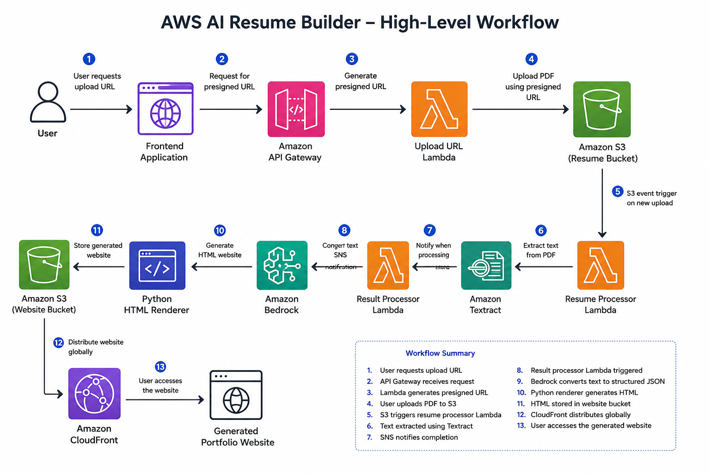

# Architecture Overview

## Solution Objective

The AWS AI Resume Builder is designed to automatically convert a PDF resume into a professional static portfolio website using a fully serverless and event-driven architecture.

The primary design goals are:

* Eliminate manual website creation
* Minimize operational overhead
* Scale automatically with demand
* Follow AWS security best practices
* Separate responsibilities across managed AWS services

---
## High-Level Architecture

The following diagram illustrates the end-to-end workflow of the AWS AI Resume Builder:

The solution uses a serverless and event-driven architecture. Each AWS service performs a specific responsibility, from secure file upload and document processing to AI-based resume understanding and website delivery.

--- 

# Key Architectural Decisions

## Direct Browser Uploads

Instead of uploading PDF files through AWS Lambda, the application uses Amazon S3 Presigned URLs.

### Benefits

* Reduces Lambda execution time
* Lowers operational cost
* Improves scalability
* Keeps the S3 bucket private
* Eliminates unnecessary data transfer through Lambda

---

## Event-Driven Processing

The application processes resumes only after an upload event occurs.

This removes the need for continuous polling and allows AWS managed services to invoke processing components only when required.

---

## Separation of Responsibilities

Each AWS service performs a single primary function.

| Service           | Responsibility                                        |
| ----------------- | ----------------------------------------------------- |
| Amazon S3         | Store uploaded resumes and generated websites         |
| AWS Lambda        | Execute application logic                             |
| Amazon Textract   | Extract text from PDF resumes                         |
| Amazon SNS        | Notify when document processing completes             |
| Amazon Bedrock    | Convert unstructured resume text into structured JSON |
| Python Renderer   | Generate consistent HTML pages                        |
| Amazon CloudFront | Deliver websites globally                             |

This design improves maintainability, security and scalability.

## Architecture Decision Records

Important architectural decisions are documented separately to keep the architecture overview concise and easy to understand.

The complete ADR index is available here:

- [Architecture Decision Records](decisions/README.md)

ADRs will be created and updated as each project phase is implemented and validated.