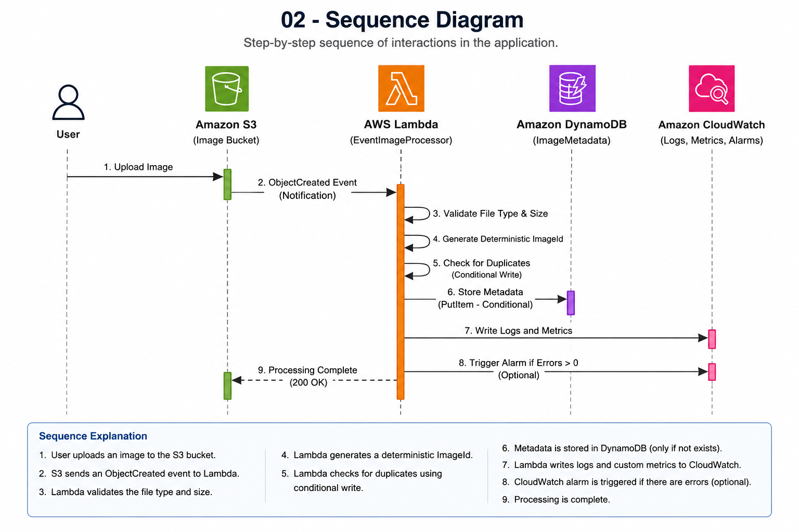

# 🚀 AWS Event-Driven Image Processing


> A production-inspired serverless application built on AWS that automatically processes image uploads using **Amazon S3**, **AWS Lambda**, **Amazon DynamoDB**, and **Amazon CloudWatch**.

---

## 🌟 Project Overview

This project demonstrates how to build a scalable, secure, and reliable **event-driven serverless application** using AWS managed services.

When a user uploads an image to Amazon S3, the application automatically processes the upload using AWS Lambda, validates the file, prevents duplicate processing, stores metadata in Amazon DynamoDB, and publishes operational logs and metrics to Amazon CloudWatch.

The primary goal of this project is not only to build a working application but also to demonstrate real-world cloud engineering practices including:

- Event-Driven Architecture
- Serverless Computing
- Cloud Security
- Observability
- Reliability Engineering
- Cost Optimization
- Operational Excellence
- Technical Documentation

---

# 📌 Project Highlights

- ✅ Event-Driven Serverless Architecture
- ✅ Amazon S3 Event Notifications
- ✅ AWS Lambda Processing
- ✅ Amazon DynamoDB Metadata Storage
- ✅ Structured JSON Logging
- ✅ CloudWatch Dashboard & Alarm
- ✅ Idempotent Processing
- ✅ File Validation
- ✅ Least-Privilege IAM
- ✅ Versioning & Encryption
- ✅ Operations Guide
- ✅ Cost Analysis
- ✅ Production-Inspired Documentation

---

# 🏗 Architecture

> **High-Level Architecture**


---
# ⚙️ Solution Workflow

The following sequence diagram illustrates the end-to-end workflow from image upload through event processing, metadata storage, and operational monitoring.



### Processing Steps

1. A user uploads an image to the Amazon S3 bucket.
2. Amazon S3 generates an **ObjectCreated** event notification.
3. AWS Lambda is invoked automatically.
4. The Lambda function validates the uploaded file.
5. A deterministic `ImageId` is generated.
6. DynamoDB performs a conditional write to prevent duplicate processing.
7. Image metadata is stored in the `ImageMetadata` table.
8. Structured logs and metrics are published to Amazon CloudWatch.
9. CloudWatch dashboards and alarms provide operational visibility into the application.
---

# ✨ Features

The application automatically performs the following operations whenever a supported image is uploaded.

- Upload images to Amazon S3
- Automatically trigger AWS Lambda
- Validate uploaded file types
- Generate deterministic image identifiers
- Prevent duplicate processing
- Store metadata in Amazon DynamoDB
- Publish structured JSON logs
- Monitor application health using CloudWatch
- Detect failures using CloudWatch Alarms
- Apply least-privilege IAM permissions
- Protect objects using Versioning and Encryption

---

# ☁️ AWS Services Used

| AWS Service | Purpose |
|-------------|---------|
| Amazon S3 | Store uploaded images and trigger processing events |
| AWS Lambda | Validate images and process upload events |
| Amazon DynamoDB | Store image metadata |
| Amazon CloudWatch | Logs, Metrics, Dashboard, and Alarm |
| AWS IAM | Secure access using least-privilege permissions |

---

# 🧱 Architecture Layers

Instead of documenting individual AWS services, this project is organized using architecture layers.

| Layer | Documentation |
|--------|---------------|
| Storage Layer | `docs/01-storage-layer.md` |
| Event Layer | `docs/02-event-layer.md` |
| Data Layer | `docs/03-data-layer.md` |
| Observability Layer | `docs/04-observability-layer.md` |
| Reliability Layer | `docs/05-reliability-layer.md` |
| Operations Guide | `docs/06-operations-guide.md` |
| Cost Analysis | `docs/07-cost-analysis.md` |

---

# 📂 Repository Structure

```text
aws-event-driven-image-processing/

├── README.md
├── PROJECT_SUMMARY.md
├── INTERVIEW_GUIDE.md
│
├── architecture/
│   ├── README.md
│   └── images/
│
├── docs/
│   ├── 01-storage-layer.md
│   ├── 02-event-layer.md
│   ├── 03-data-layer.md
│   ├── 04-observability-layer.md
│   ├── 05-reliability-layer.md
│   ├── 06-operations-guide.md
│   └── 07-cost-analysis.md
│
├── lambda/
│   └── lambda_function.py
│
├── screenshots/
│
└── sample-images/
```

---

# 📚 Documentation

This repository contains detailed architecture documentation for every layer of the solution.

| Document | Description |
|----------|-------------|
| `PROJECT_SUMMARY.md` | Executive summary of the complete project |
| `01-storage-layer.md` | Amazon S3 architecture and design decisions |
| `02-event-layer.md` | Event-driven processing using S3 Event Notifications and Lambda |
| `03-data-layer.md` | Metadata storage using DynamoDB |
| `04-observability-layer.md` | Monitoring using CloudWatch Logs, Metrics, Dashboard and Alarm |
| `05-reliability-layer.md` | Reliability improvements including idempotency and validation |
| `06-operations-guide.md` | Deployment, monitoring, troubleshooting and cleanup |
| `07-cost-analysis.md` | Cost optimization and operational cost analysis |

---

# 📷 Project Screenshots

The project includes implementation evidence captured throughout development.

Examples include:

- Amazon S3 Configuration
- Event Notification
- AWS Lambda Configuration
- DynamoDB Metadata
- CloudWatch Dashboard
- CloudWatch Alarm
- Structured Logs
- Reliability Validation
- Cost Optimization

---

# 🔐 Security

Security was incorporated throughout the project by following AWS security best practices.

### Security Controls

- Server-Side Encryption (SSE-S3)
- Bucket Owner Enforced Object Ownership
- IAM Least-Privilege Permissions
- Resource-Based Policies
- File Type Validation
- Controlled Error Responses
- Versioning Enabled
- Public Access Blocked (except where required)

### Security Highlights

- Images are encrypted at rest.
- Lambda has only the permissions required to perform its tasks.
- Unsupported file types are rejected before processing.
- Duplicate events cannot overwrite existing metadata.
- Sensitive information is not exposed through application responses.

---

# 📊 Observability

Operational visibility is implemented using Amazon CloudWatch.

The application provides visibility into both successful processing and operational failures.

### Monitoring Features

- Structured JSON Logs
- Lambda Invocation Metrics
- Lambda Error Metrics
- Lambda Duration Metrics
- CloudWatch Dashboard
- CloudWatch Alarm
- Processing Status Tracking

### Structured Logging

Every Lambda invocation generates structured logs containing:

- Request ID
- Bucket Name
- Object Key
- Processing Status
- Processing Duration
- Error Details (when applicable)

This makes troubleshooting significantly easier than relying on plain-text log messages.

---

# 🛡 Reliability

The project includes several reliability improvements commonly used in production serverless applications.

### Reliability Features

- Deterministic ImageId
- Idempotent Processing
- Conditional DynamoDB Writes
- Duplicate Event Protection
- File Validation
- Processing Status Tracking
- Exception Handling

### Processing States

```text
RECEIVED

↓

VALIDATED

↓

METADATA_STORED
```

Duplicate events:

```text
RECEIVED

↓

VALIDATED

↓

DUPLICATE
```

Unsupported uploads:

```text
RECEIVED

↓

REJECTED
```

Unexpected failures:

```text
FAILED
```

These states provide clear operational visibility throughout the processing lifecycle.

---

# 💰 Cost Optimization

Although this project is designed primarily for learning, cost optimization was considered throughout the architecture.

### Cost Optimization Techniques

- Serverless Architecture
- On-Demand DynamoDB Capacity
- Prefix Filtering
- Structured Logging
- CloudWatch Log Retention
- Idempotent Processing
- Resource Cleanup Documentation

### Cost Benefits

- No continuously running servers.
- Lambda executes only when images are uploaded.
- Duplicate events do not create additional database records.
- Logs are retained for a limited period.
- Resources can be safely removed after testing.

---

# 🏛 AWS Well-Architected Framework

The solution incorporates practices aligned with several pillars of the AWS Well-Architected Framework.

| Pillar | Implementation |
|----------|----------------|
| Operational Excellence | Operations Guide, Documentation, Monitoring |
| Security | IAM Least Privilege, Encryption, Validation |
| Reliability | Idempotency, Exception Handling, CloudWatch Alarms |
| Performance Efficiency | Serverless Architecture, Event-Driven Processing |
| Cost Optimization | Serverless Services, Log Retention, Cleanup Strategy |

---

# 🎯 Engineering Skills Demonstrated

This project demonstrates practical experience with the following cloud engineering concepts.

### Architecture

- Event-Driven Architecture
- Serverless Architecture
- Layered System Design

### AWS Services

- Amazon S3
- AWS Lambda
- Amazon DynamoDB
- Amazon CloudWatch
- AWS IAM

### Engineering Practices

- Cloud Security
- Reliability Engineering
- Observability
- Cost Optimization
- Operational Excellence
- Technical Documentation

### Software Engineering

- Python
- Structured Logging
- Error Handling
- Input Validation
- Idempotent Processing
- Configuration Management

---

# 📈 Project Progress

| Phase | Status |
|---------|:------:|
| Storage Layer | ✅ |
| Event Layer | ✅ |
| Data Layer | ✅ |
| Observability Layer | ✅ |
| Reliability Layer | ✅ |
| Operations Guide | ✅ |
| Cost Analysis | ✅ |
| Architecture Documentation | 🚧 In Progress |
| Portfolio Enhancements | 🚧 In Progress |

---

# 📊 Project Statistics

| Category | Value |
|----------|------:|
| AWS Services | 5 |
| Architecture Layers | 5 |
| Documentation Pages | 7 |
| Lambda Functions | 1 |
| CloudWatch Dashboard | 1 |
| CloudWatch Alarm | 1 |
| Python Modules | 1 |
| Project Type | Event-Driven Serverless |

---

# 🧪 Validation

The solution has been tested using multiple scenarios.

### Successful Scenarios

- Image Upload
- Metadata Storage
- Structured Logging
- Dashboard Monitoring
- Alarm Validation

### Reliability Scenarios

- Duplicate Event Processing
- Unsupported File Validation
- Invalid Event Handling
- Exception Logging

### Operational Validation

- CloudWatch Metrics
- CloudWatch Dashboard
- CloudWatch Alarm
- DynamoDB Metadata Verification

---

# 🚀 Getting Started

Follow these steps to deploy the project in your AWS account.

## Prerequisites

Before deploying the project, ensure you have:

- An AWS Account
- Basic understanding of Amazon S3
- AWS Lambda
- Amazon DynamoDB
- AWS IAM
- Amazon CloudWatch
- Python 3.x

---

## Deployment Steps

### Step 1 — Create an Amazon S3 Bucket

- Create a new S3 bucket.
- Enable Versioning.
- Enable Server-Side Encryption.
- Configure Bucket Owner Enforced Object Ownership.
- Upload sample images using the `uploads/` prefix.

---

### Step 2 — Create the DynamoDB Table

Create a table named:

```text
ImageMetadata
```

Primary Key:

```text
ImageId (String)
```

Capacity Mode:

```text
On-Demand
```

---

### Step 3 — Deploy the Lambda Function

- Create the Lambda function.
- Upload the Python source code.
- Configure the execution role.
- Set the environment variable:

```text
TABLE_NAME=ImageMetadata
```

---

### Step 4 — Configure S3 Event Notification

Configure an **ObjectCreated** event notification.

Prefix:

```text
uploads/
```

Destination:

```text
AWS Lambda
```

---

### Step 5 — Configure CloudWatch

Create:

- CloudWatch Dashboard
- CloudWatch Alarm
- Log Retention Policy

---

### Step 6 — Validate the Solution

Upload a sample image.

Verify:

- Lambda Invocation
- DynamoDB Metadata
- CloudWatch Logs
- Dashboard Metrics
- Alarm Status

---

# 📸 Project Screenshots

The project includes implementation evidence for each major architecture layer.

| Screenshot | Description |
|------------|-------------|
| Amazon S3 Configuration | Bucket configuration and Versioning |
| Event Notification | Amazon S3 triggering AWS Lambda |
| Lambda Configuration | Function settings and environment variables |
| DynamoDB | Image metadata storage |
| CloudWatch Dashboard | Operational monitoring |
| CloudWatch Alarm | Error monitoring |
| Structured Logs | JSON logging |
| Reliability Validation | Duplicate event handling |

Additional screenshots are available in the `screenshots/` directory.

---

# 🔮 Future Enhancements

This project establishes a strong serverless foundation and can be extended in several ways.

## Planned Improvements

- Amazon SQS
- Dead Letter Queue (DLQ)
- Amazon EventBridge
- AWS Step Functions
- AWS X-Ray
- Amazon SNS Notifications
- Thumbnail Generation
- Image Resizing
- Image Compression
- CI/CD Pipeline
- Infrastructure as Code (Terraform)
- Automated Testing
- AWS Config Rules
- AWS Security Hub

These enhancements will improve scalability, reliability, automation, and operational maturity.

---

# 📖 References

The following AWS documentation was used during the implementation of this project.

- Amazon S3 Documentation
- AWS Lambda Documentation
- Amazon DynamoDB Documentation
- Amazon CloudWatch Documentation
- AWS IAM Documentation
- AWS Well-Architected Framework
- AWS Pricing Calculator
- AWS Architecture Center

---

# 🤝 Contributing

This repository is part of my AWS Cloud Engineering learning journey.

Suggestions, feedback, and recommendations are always welcome.

If you identify opportunities for improvement, feel free to open an issue or submit a pull request.

---

# 📄 License

This project is licensed under the MIT License.

---

# 👨‍💻 Author

**Baji Pathan**

Cloud Engineer | Observability Engineer | AWS Learner

This project was built to strengthen practical AWS cloud engineering skills through hands-on implementation and production-inspired architecture.

---

# 🙏 Acknowledgements

Special thanks to:

- AWS Documentation
- AWS Well-Architected Framework
- AWS Architecture Center
- The AWS Community

for providing guidance and best practices that inspired the design and implementation of this project.

---

# ⭐ If You Found This Project Useful

If you found this repository helpful:

- ⭐ Star the repository
- 🍴 Fork the repository
- 💬 Share feedback
- 🤝 Connect with me on LinkedIn

---

# 📌 Key Takeaways

This project demonstrates much more than a simple serverless application.

It showcases the complete lifecycle of building an AWS solution—from architecture and implementation to monitoring, reliability, cost optimization, operations, and documentation.

Key concepts demonstrated include:

- Event-Driven Architecture
- Serverless Computing
- Cloud Security
- Observability
- Reliability Engineering
- Cost Optimization
- Operational Excellence
- AWS Well-Architected Principles
- Technical Documentation

By completing this project, I strengthened my ability to design, build, document, and operate production-inspired cloud solutions using AWS managed services.

This repository represents the first project in my AWS Cloud Engineering portfolio and serves as a foundation for future production-inspired cloud projects.