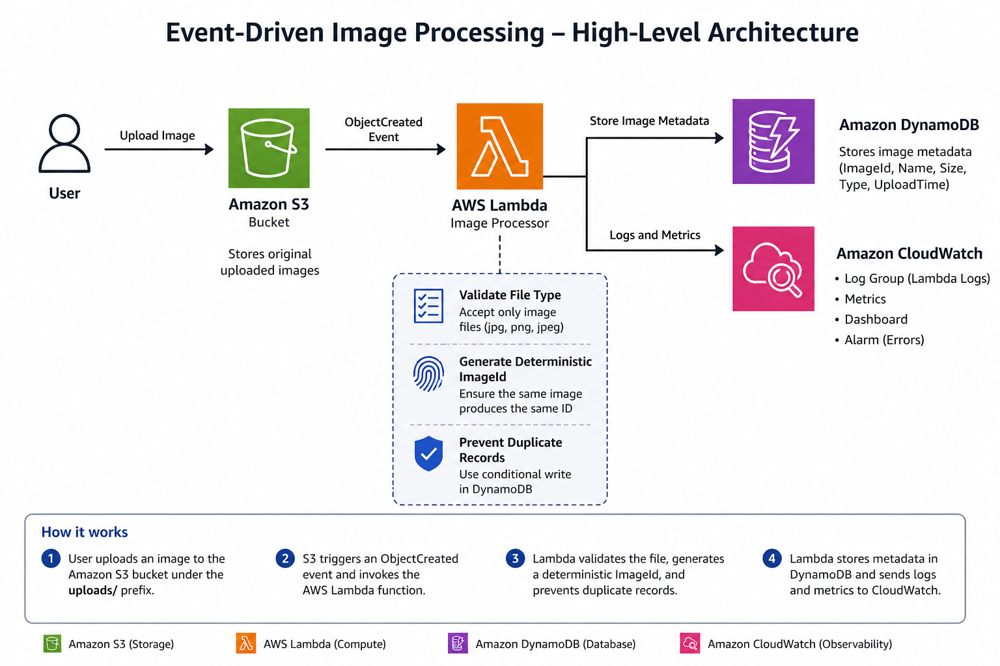
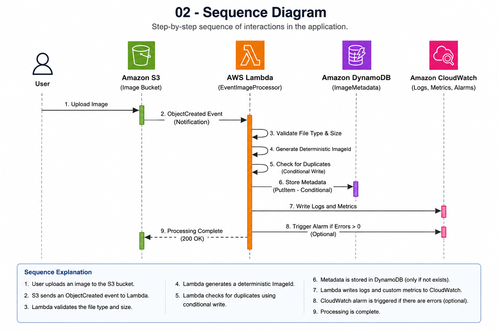

# 🚀 AWS Event-Driven Image Processing


> A production-inspired serverless application built on AWS that automatically processes image uploads using **Amazon S3**, **AWS Lambda**, **Amazon DynamoDB**, and **Amazon CloudWatch**.

---

## 🌟 Project Overview

## 🌟 Project Overview

AWS Event-Driven Image Processing is a production-inspired serverless application that automatically processes image uploads using Amazon S3 Event Notifications, AWS Lambda, Amazon DynamoDB, and Amazon CloudWatch.

The project demonstrates how to design and implement a scalable, secure, observable, and cost-effective event-driven architecture using AWS managed services while following production-inspired cloud engineering practices.

---

# 🏢 Business Problem

Many cloud applications rely on manual or tightly coupled processing workflows that can become difficult to scale, maintain, and monitor as workloads increase.

Modern cloud-native applications often require an event-driven approach where services react automatically to events without requiring continuous infrastructure or manual intervention. Building these systems also requires careful consideration of reliability, security, observability, and operational excellence.

This project demonstrates how AWS managed services can be combined to build an automated image processing pipeline that follows production-inspired cloud engineering practices.

---

# 💡 Solution

AWS Event-Driven Image Processing is a production-inspired serverless application that automatically processes image uploads using Amazon S3 Event Notifications and AWS Lambda.

When an image is uploaded, Amazon S3 generates an event that invokes an AWS Lambda function. The function validates the uploaded file, generates a deterministic image identifier, stores image metadata in Amazon DynamoDB, and publishes operational logs and metrics to Amazon CloudWatch.

The solution demonstrates how event-driven architectures can improve scalability, reduce operational overhead, and enable loosely coupled cloud-native applications using fully managed AWS services.

---

# 🎯 Engineering Goals

This project was designed to strengthen practical cloud engineering skills by implementing a production-inspired event-driven serverless application on AWS.

Key objectives include:

- Build an event-driven architecture using Amazon S3 Event Notifications and AWS Lambda.
- Process uploaded images automatically without manual intervention.
- Implement idempotent processing to prevent duplicate records.
- Persist metadata using Amazon DynamoDB.
- Apply AWS security best practices with IAM and encryption.
- Implement operational monitoring using Amazon CloudWatch.
- Produce comprehensive documentation, architecture diagrams, and operational guidance.

---

# 🏗 Solution Architecture

> **High-Level Architecture**



---
# 🔄 Application Workflow

The following sequence diagram illustrates the end-to-end workflow from image upload through event processing, metadata storage, and operational monitoring.



### Processing Steps

1. A user uploads an image to the Amazon S3 bucket.
2. Amazon S3 generates an **ObjectCreated** event notification.
3. AWS Lambda is invoked automatically.
4. The Lambda function validates the uploaded file.
5. A deterministic `ImageId` is generated.
6. DynamoDB performs a conditional write to prevent duplicate processing.
7. Image metadata is stored in the `ImageMetadata` table.
8. Structured logs and metrics are published to Amazon CloudWatch.
9. CloudWatch dashboards and alarms provide operational visibility into the application.
---

# ✨ Key Features

The application automatically performs the following operations whenever a supported image is uploaded.

- Upload images to Amazon S3
- Automatically trigger AWS Lambda
- Validate uploaded file types
- Generate deterministic image identifiers
- Prevent duplicate processing
- Store metadata in Amazon DynamoDB
- Publish structured JSON logs
- Monitor application health using CloudWatch
- Detect failures using CloudWatch Alarms
- Apply least-privilege IAM permissions
- Protect objects using Versioning and Encryption

---

# ☁️ AWS Services Used

| AWS Service | Purpose |
|-------------|---------|
| Amazon S3 | Store uploaded images and trigger processing events |
| AWS Lambda | Validate images and process upload events |
| Amazon DynamoDB | Store image metadata |
| Amazon CloudWatch | Logs, Metrics, Dashboard, and Alarm |
| AWS IAM | Secure access using least-privilege permissions |

---

# 🧱 Architecture Layers

Instead of documenting individual AWS services, this project is organized using architecture layers.

| Layer | Documentation |
|--------|---------------|
| Storage Layer | **[Storage Layer](docs/01-storage-layer.md)** |
| Event Layer | **[Event Layer](docs/02-event-layer.md)** |
| Data Layer | **[Data Layer](docs/03-data-layer.md)** |
| Observability Layer | **[Observability Layer](docs/04-observability-layer.md)** |
| Reliability Layer | **[Reliability Layer](docs/05-reliability-layer.md)** |
| Operations Guide | **[Operations Guide](docs/06-operations-guide.md)** |
| Cost Analysis | **[Cost Analysis](docs/07-cost-analysis.md)** |

---

# 📂 Repository Structure

```text
aws-event-driven-image-processing/

├── README.md
├── PROJECT_SUMMARY.md
├── INTERVIEW_GUIDE.md
│
├── architecture/
│   ├── README.md
│   └── images/
│
├── docs/
│   ├── 01-storage-layer.md
│   ├── 02-event-layer.md
│   ├── 03-data-layer.md
│   ├── 04-observability-layer.md
│   ├── 05-reliability-layer.md
│   ├── 06-operations-guide.md
│   └── 07-cost-analysis.md
│
├── lambda/
│   └── lambda_function.py
│
├── screenshots/
│
└── sample-images/
```

---

# 📚 Documentation

| Document | Description |
|----------|-------------|
| **[PROJECT_SUMMARY.md](PROJECT_SUMMARY.md)** | Executive overview of the project |
| **[INTERVIEW_GUIDE.md](INTERVIEW_GUIDE.md)** | Interview questions and discussion points |
| **[architecture/](architecture/README.md)** | Architecture diagrams and design decisions |
| **[docs/](docs/)** | Detailed implementation guides organized by architecture layer |

---

# 🔐 Security

Security was incorporated throughout the project by following AWS security best practices.

### Security Controls

- Server-Side Encryption (SSE-S3)
- Bucket Owner Enforced Object Ownership
- IAM Least-Privilege Permissions
- Resource-Based Policies
- File Type Validation
- Controlled Error Responses
- Versioning Enabled
- Public Access Blocked (except where required)

### Security Highlights

- Images are encrypted at rest.
- Lambda has only the permissions required to perform its tasks.
- Unsupported file types are rejected before processing.
- Duplicate events cannot overwrite existing metadata.
- Sensitive information is not exposed through application responses.

---

# 📊 Observability

Operational visibility is implemented using Amazon CloudWatch.

The application provides visibility into both successful processing and operational failures.

### Monitoring Features

- Structured JSON Logs
- Lambda Invocation Metrics
- Lambda Error Metrics
- Lambda Duration Metrics
- CloudWatch Dashboard
- CloudWatch Alarm
- Processing Status Tracking

### Structured Logging

Every Lambda invocation generates structured logs containing:

- Request ID
- Bucket Name
- Object Key
- Processing Status
- Processing Duration
- Error Details (when applicable)

This makes troubleshooting significantly easier than relying on plain-text log messages.

---

# 🛡 Reliability

The project includes several reliability improvements commonly used in production serverless applications.

### Reliability Features

- Deterministic ImageId
- Idempotent Processing
- Conditional DynamoDB Writes
- Duplicate Event Protection
- File Validation
- Processing Status Tracking
- Exception Handling

### Processing States

```text
RECEIVED

↓

VALIDATED

↓

METADATA_STORED
```

Duplicate events:

```text
RECEIVED

↓

VALIDATED

↓

DUPLICATE
```

Unsupported uploads:

```text
RECEIVED

↓

REJECTED
```

Unexpected failures:

```text
FAILED
```

These states provide clear operational visibility throughout the processing lifecycle.

---

# 💰 Cost Optimization

Although this project is designed primarily for learning, cost optimization was considered throughout the architecture.

### Cost Optimization Techniques

- Serverless Architecture
- On-Demand DynamoDB Capacity
- Prefix Filtering
- Structured Logging
- CloudWatch Log Retention
- Idempotent Processing
- Resource Cleanup Documentation

### Cost Benefits

- No continuously running servers.
- Lambda executes only when images are uploaded.
- Duplicate events do not create additional database records.
- Logs are retained for a limited period.
- Resources can be safely removed after testing.

---

# 🏛 AWS Well-Architected Framework

The solution incorporates practices aligned with several pillars of the AWS Well-Architected Framework.

| Pillar | Implementation |
|----------|----------------|
| Operational Excellence | Operations Guide, Documentation, Monitoring |
| Security | IAM Least Privilege, Encryption, Validation |
| Reliability | Idempotency, Exception Handling, CloudWatch Alarms |
| Performance Efficiency | Serverless Architecture, Event-Driven Processing |
| Cost Optimization | Serverless Services, Log Retention, Cleanup Strategy |

---
# 🚀 Project Status

**Status:** ✅ Complete

This project is feature complete as a production-inspired event-driven serverless application.

The implementation includes:

- Event-driven image processing with Amazon S3 Event Notifications
- AWS Lambda image validation and metadata processing
- Amazon DynamoDB metadata storage
- Structured logging and CloudWatch monitoring
- Reliability improvements through idempotent processing
- Security best practices using IAM, encryption, and versioning
- Comprehensive technical documentation and architecture diagrams

Future enhancements will continue to expand the solution using additional AWS services while maintaining the same production-inspired engineering principles.

---

# ✅ Validation

The application was validated using multiple functional and operational scenarios, including successful image processing, duplicate event handling, unsupported file validation, CloudWatch monitoring, and DynamoDB metadata verification.

Detailed validation steps and operational procedures are available in the **Operations Guide** located in the `docs/` directory.

---

# 🚀 Getting Started

Follow these steps to deploy the project in your AWS account.

## Prerequisites

Before deploying the project, ensure you have:

- An AWS Account
- Basic understanding of Amazon S3
- AWS Lambda
- Amazon DynamoDB
- AWS IAM
- Amazon CloudWatch
- Python 3.x

---

## Deployment Steps

### Step 1 — Create an Amazon S3 Bucket

- Create a new S3 bucket.
- Enable Versioning.
- Enable Server-Side Encryption.
- Configure Bucket Owner Enforced Object Ownership.
- Upload sample images using the `uploads/` prefix.

---

### Step 2 — Create the DynamoDB Table

Create a table named:

```text
ImageMetadata
```

Primary Key:

```text
ImageId (String)
```

Capacity Mode:

```text
On-Demand
```

---

### Step 3 — Deploy the Lambda Function

- Create the Lambda function.
- Upload the Python source code.
- Configure the execution role.
- Set the environment variable:

```text
TABLE_NAME=ImageMetadata
```

---

### Step 4 — Configure S3 Event Notification

Configure an **ObjectCreated** event notification.

Prefix:

```text
uploads/
```

Destination:

```text
AWS Lambda
```

---

### Step 5 — Configure CloudWatch

Create:

- CloudWatch Dashboard
- CloudWatch Alarm
- Log Retention Policy

---

### Step 6 – Test the Deployment

Upload a supported image to the S3 bucket and verify:

- Lambda invocation
- DynamoDB metadata
- CloudWatch logs
- Dashboard metrics
- Alarm status

Refer to the **Operations Guide** for the complete validation checklist.

---

# 📸 Project Screenshots

The repository includes screenshots captured throughout the implementation process, demonstrating the configuration, deployment, monitoring, and validation of each major component.

| Screenshot | Description |
|------------|-------------|
| Amazon S3 Configuration | Bucket configuration and Versioning |
| Event Notification | Amazon S3 triggering AWS Lambda |
| Lambda Configuration | Function settings and environment variables |
| DynamoDB | Image metadata storage |
| CloudWatch Dashboard | Operational monitoring |
| CloudWatch Alarm | Error monitoring |
| Structured Logs | JSON logging |
| Reliability Validation | Duplicate event handling |

Additional screenshots are available in the `screenshots/` directory.

---

# 🔮 Future Enhancements

This project establishes a strong serverless foundation and can be extended in several ways.

## Planned Improvements

- Amazon SQS
- Dead Letter Queue (DLQ)
- Amazon EventBridge
- AWS Step Functions
- AWS X-Ray
- Amazon SNS Notifications
- Thumbnail Generation
- Image Resizing
- Image Compression
- CI/CD Pipeline
- Infrastructure as Code (Terraform)
- Automated Testing
- AWS Config Rules
- AWS Security Hub

These enhancements will improve scalability, reliability, automation, and operational maturity.

---
# 🔗 Continue Exploring

If you found this project useful, you may also be interested in exploring other production-inspired AWS projects in this portfolio:

- 🤖 [AWS AI Resume Builder](../aws-ai-resume-builder)
- ✨ [Serverless AI CV Enhancer](../aws-serverless-ai-cv-enhancer)
- 🔄 [Serverless DynamoDB CRUD API](../serverless-dynamodb-crud-api)
- ⚡ [AWS Lambda Execution Profiler](../aws-lambda-execution-profiler)
- 🌐 [Static Website Hosting on Amazon S3](../static-website-hosting-on-amazon-s3)

You can also return to the **[AWS Cloud Engineering Portfolio](../README.md)** to explore additional projects, architecture patterns, and cloud engineering documentation.

--- 


# 📄 License

This project is licensed under the MIT License.

---

# 🙏 Acknowledgements

This project was built as part of my AWS Cloud Engineering portfolio to strengthen my understanding of event-driven architectures and production-inspired serverless application design.

Special thanks to:

- AWS Documentation
- AWS Well-Architected Framework
- AWS Architecture Center
- The AWS Community

for providing the guidance and best practices that informed the design and implementation of this project.

---

# ⭐ If You Found This Project Useful

If you found this repository helpful:

- ⭐ Star the repository
- 🍴 Fork the repository
- 💬 Share feedback
- 🤝 Connect with me on LinkedIn

---
