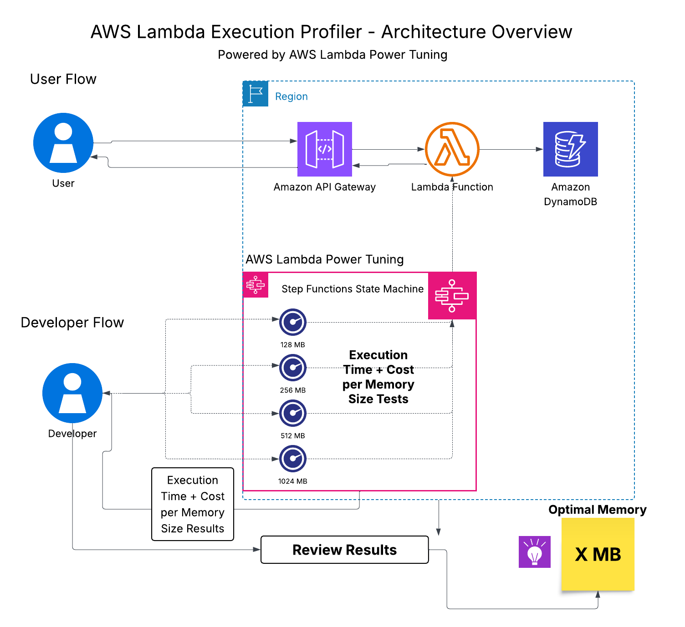

# ⚡ AWS Lambda Execution Profiler  
Optimize Lambda performance using AWS Lambda Power Tuning

The **AWS Lambda Execution Profiler** is a hands‑on, production‑grade project that benchmarks a Lambda function across multiple memory configurations to identify the **optimal balance between performance and cost**.

It uses the open‑source **Lambda Power Tuning** state machine (AWS Step Functions) to run controlled performance tests and generate visual insights.

This project is ideal for:
- Cloud learners  
- AWS Solutions Architect prep  
- Performance engineers  
- Anyone optimizing Lambda workloads  

---

# 🚀 Features

- Benchmarks Lambda across multiple memory tiers  
- Measures execution time and cost  
- Generates visual performance graphs  
- Identifies best/worst memory configurations  
- Provides architecture diagrams, ADRs, deployment & cleanup guides  
- Beginner‑friendly but production‑aligned  

---

# 🏗 Architecture Overview

The project uses two flows:
- **User Flow (Application Path)**
- **Developer Flow (Profiling Path)**

---

# 🧱 Architecture Decision Records (ADRs)

This project includes formal ADRs documenting key design decisions.

| ADR | Title | Status |
|-----|--------|---------|
| [ADR‑001](./docs/adr/adr-001-choose-step-functions.md) | Choosing AWS Step Functions | Accepted |
| [ADR‑002](./docs/adr/adr-002-memory-configurations.md) | Memory Configurations to Test | Accepted |
| [ADR‑003](./docs/adr/adr-003-store-results-json.md) | Storing Results in JSON | Accepted |

Full ADR index:  
👉 [ADR](./docs/adr/README.md)

---

## 🧭 Alignment with the AWS Well‑Architected Framework

This project aligns with all six pillars:

- **Operational Excellence** → Uses automated, repeatable profiling with Step Functions to improve observability and decision‑making.
- **Security** → Follows least‑privilege IAM roles and isolates profiling from production traffic.
- **Reliability** → Leverages fully managed services (Lambda, Step Functions) that provide built‑in fault tolerance.
- **Performance Efficiency** → Identifies the optimal Lambda memory configuration using real execution data instead of assumptions.
- **Cost Optimization** → Highlights the most cost‑efficient memory tier and prevents over‑provisioning.
- **Sustainability** → Reduces compute waste by selecting the most efficient configuration, lowering resource usage.

---

# 📊 Profiling Results

The profiler evaluates Lambda performance at:

- 128 MB  
- 256 MB  
- 512 MB  
- 1024 MB  

### **Key Findings**
- **Best Cost:** 128 MB  
- **Best Time:** 1024 MB  
- **Worst Tier:** 256 MB  
- **Best Overall:** 1024 MB  

### 📊 Results Graph


### 📈 Results Summary Table

| Memory (MB) | Invocation Time (ms) | Invocation Cost (USD) | Verdict |
|-------------|----------------------|-------------------------|---------|
| 128 MB | 350 ms | $0.0000012 | ⭐ Best Cost |
| 256 MB | 650 ms | $0.0000028 | ❌ Worst Tier |
| 512 MB | 420 ms | $0.0000018 | 👍 Balanced |
| 1024 MB | 250 ms | $0.0000014 | ⭐ Best Time & Best Overall |

Full analysis:  
👉 [Analysis](./docs/profiling-results/README.md)

---

## 📦 Folder Structure

```text
.
├── docs/
│   ├── architecture/      # Simple architecture explanation + diagram
│   ├── deployment/        # Step-by-step deployment guide
│   ├── diagrams/          # Visual diagrams (architecture, flow, structure)
│   ├── adr/               # Architecture Decision Records
│   └── profiling-results/ # Execution results 
│   └── references/        # Learning resources used for this project
│
├── src/                   # Placeholder; source code lives in separate repo
│
├── scripts/               # Placeholder for future automation scripts
│
├── tests/                 # Placeholder for future tests
│
└── README.md              # Main project documentation

```
---

## 📄 Deployment Guide

A complete, beginner‑friendly deployment guide is available here:

👉 [Deployment Guide](docs/deployment/deployment-guide.md)

---
## 🧼 Clean‑up Instructions

To avoid unnecessary AWS charges, the cleanup guide explains how to delete:

A full clean‑up guide is available here:

👉 [Clean‑up Instructions](docs/deployment/cleanup-guide.md)

---

## 📚 References

A list of AWS docs, tutorials, and tools that helped me learn is available in:

👉 [References](docs/references/README.md)

---

## 🎯 Why This Project Matters
This project demonstrates how to make data‑driven decisions when optimizing AWS Lambda functions. Instead of guessing the right memory size, it uses real execution metrics to identify the most efficient configuration for both performance and cost. It reflects a practical, hands‑on approach to learning cloud fundamentals and applying AWS best practices.

---

## 📊 Project Impact
This project provides a repeatable, automated way to benchmark Lambda performance across memory tiers. It helps developers understand how CPU scaling, billed duration, and cost interact — enabling smarter architectural decisions for serverless workloads.

---

### 🛠 Technical Outcomes
- Implemented AWS Step Functions to orchestrate Lambda Power Tuning  
- Profiled Lambda execution across multiple memory configurations  
- Captured and analyzed execution time and cost metrics  
- Produced visual performance graphs and JSON‑based results  
- Documented architecture, ADRs, deployment, and cleanup processes  

---

### 💡 Practical Value
- Helps choose the **optimal Lambda memory size** using real data  
- Reduces AWS costs by avoiding inefficient configurations  
- Improves application performance through right‑sizing  
- Provides a reusable profiling workflow for future Lambda functions  
- Strengthens cloud engineering and serverless architecture skills  

---

### 🎓 What I Learned
- How Lambda memory affects CPU power, execution time, and cost  
- How to use Step Functions for orchestration and automation  
- How to interpret performance graphs and profiling results  
- How to structure a cloud project with ADRs and documentation  
- How to apply AWS Well‑Architected principles in a real scenario  

---

## ⭐ Support
If you find these projects helpful or inspiring, feel free to star the repository.