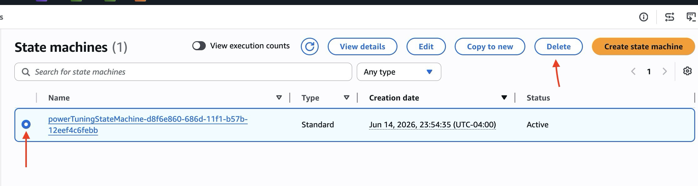

# 🧹 Cleanup Guide  
This guide helps you safely remove all AWS resources created during the deployment of the **AWS Lambda Execution Profiler**.  
Following these steps ensures you avoid unnecessary AWS charges.

---

## 🗑 1. Delete Step Functions State Machine

1. Open the **Step Functions** service in the AWS Console.  
2. Select the state machine **`lambda-execution-profiler`**.  
3. Click **Delete**.  

4. Confirm deletion.

This removes the Lambda Power Tuning workflow.

---

Note: For other resources created as part of serverless-dynamodb-crud-api, please refer that project [clean-up document](../../../serverless-dynamodb-crud-api/docs/deployment/cleanup-guide.md)

---

## 🧼 Cleanup Complete

All AWS resources created for the **AWS Lambda Execution Profiler** have now been removed.  

Your account will no longer incur charges related to this project. 🎉
