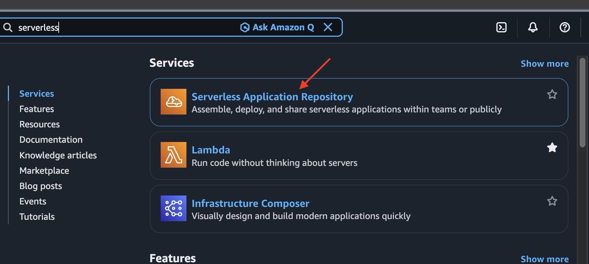
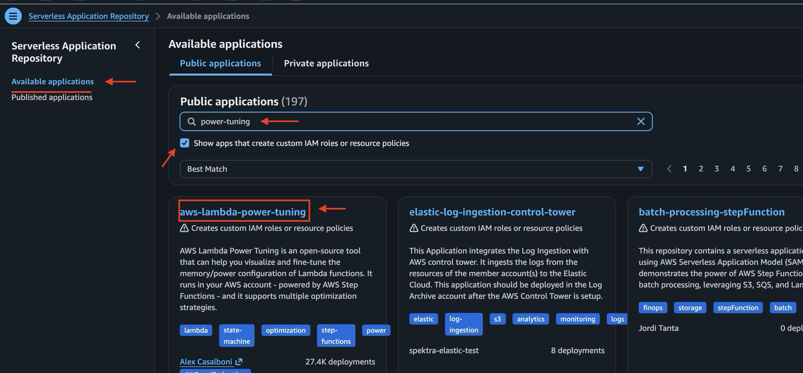
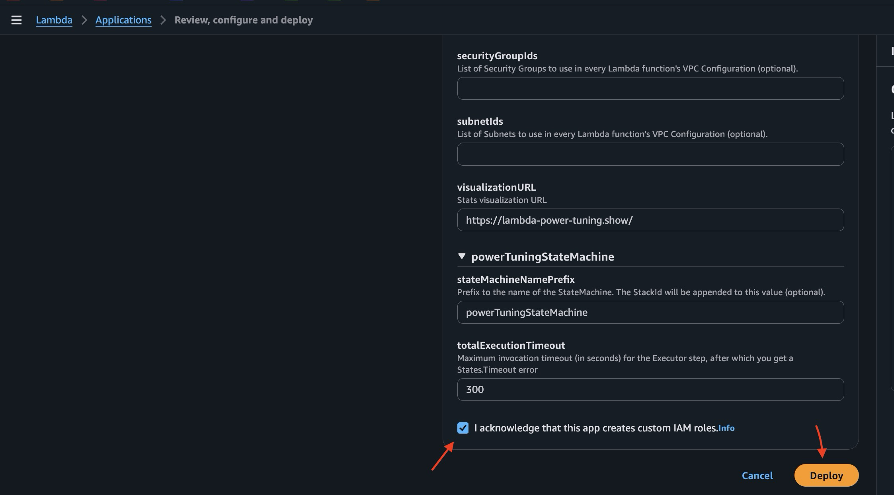
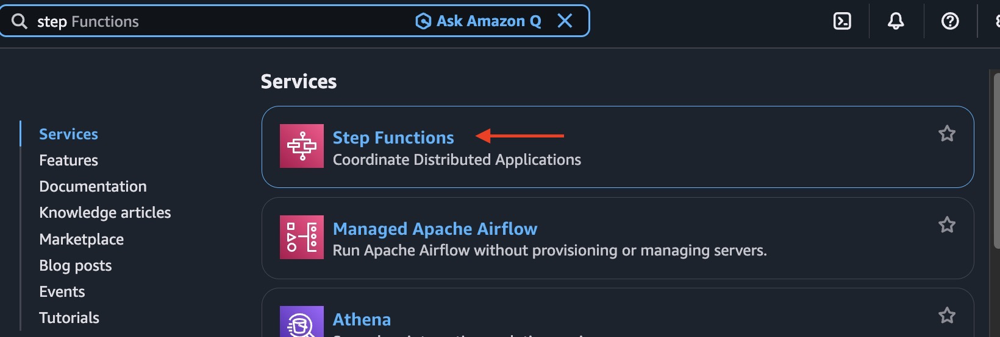
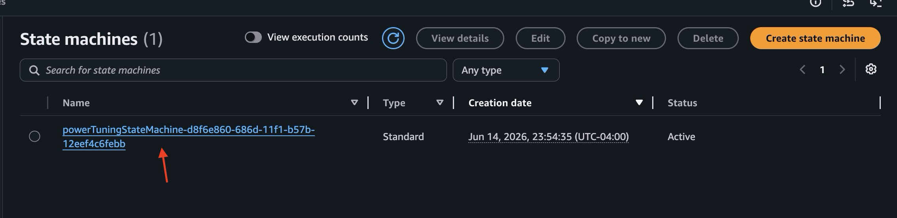
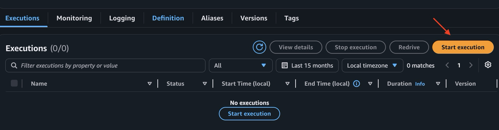
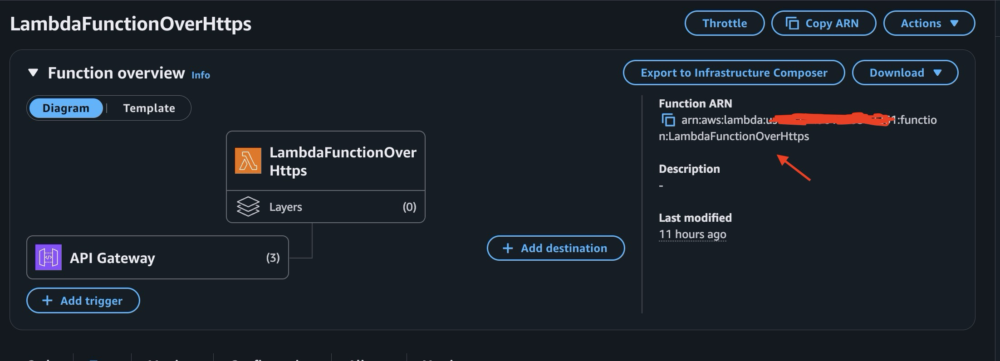
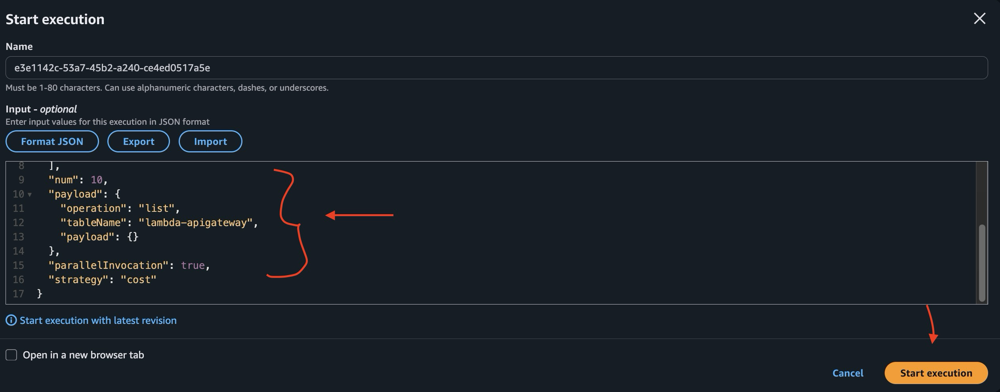
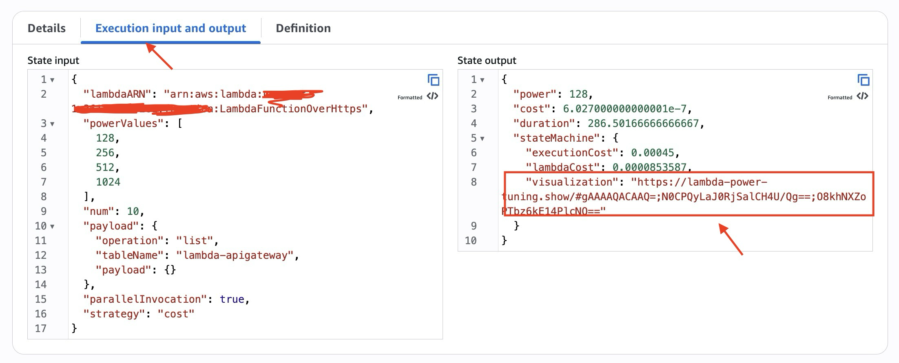
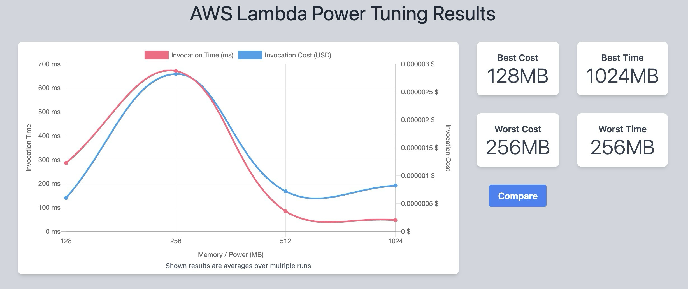

# 🚀 Deployment Guide — AWS Lambda Execution Profiler

This guide explains how to deploy the AWS Lambda Execution Profiler, including
the Lambda function, Step Functions state machine, and required IAM roles.

---

## 📦 Prerequisites

Before deploying, ensure you have:
 
- An AWS account with access to:
  - AWS Lambda
  - AWS Step Functions
  - Amazon DynamoDB
  - Amazon API Gateway
- Complete the deployments defined in the [serverless-dynamodb-crud-api](../../../serverless-dynamodb-crud-api/docs/deployment/deployment-guide.md)

---

## 🔧 1. Deploy the Step Functions State Machine
1. Go to Serverless Application Repository


2. Click Available Applications,type **“power-tuning”** in the search applications by name text box, check “Show apps that create custom IAM roles or resource policies”, and click **aws-lambda-power-tuning**


3. Scroll down, keep everything as is, check “I acknowledge that this app creates custom IAM roles”, click “Deploy”


4. Go to step functions


5. Select the State machine


6. Click **“Start execution”**


7. Get your Lambda ARN and put in the below JSON. Then copy the whole JSON and put it in input

For Lambda ARN, open your Lambda and copy the ARN number


```json
{
  "lambdaARN": "YOUR LAMBDA ARN HERE",
  "powerValues": [
    128,
    256,
    512,
    1024
  ],
  "num": 10,
  "payload": {
    "operation": "list",
    "tableName": "lambda-apigateway",
    "payload": {}
  },
  "parallelInvocation": true,
  "strategy": "cost"
}
```


8. Click Execution input and output tab, Select and copy the visualization link


9. Open the copied link in a new browser window


