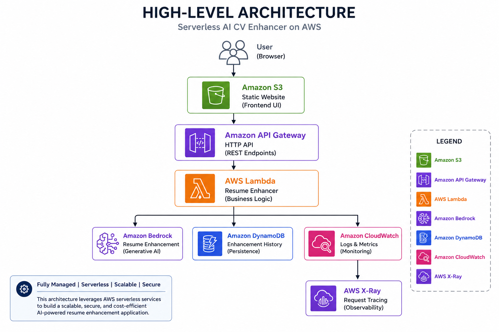
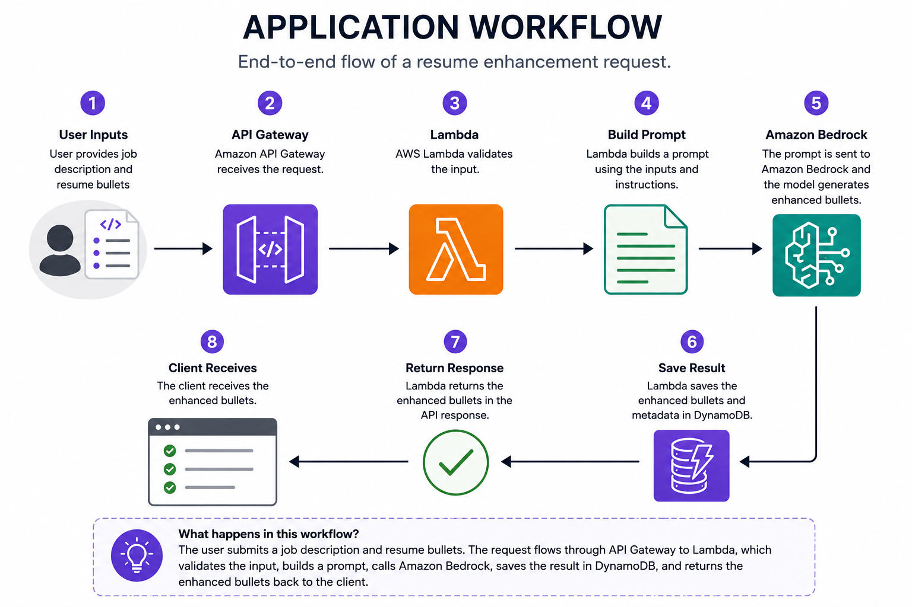

<div align="center">

# 🤖 Serverless AI CV Enhancer

### Production-inspired Serverless Generative AI Application built with AWS

Enhance resume bullet points using **Amazon Bedrock**, **AWS Lambda**, **Amazon API Gateway**, and **Amazon DynamoDB**.


</div>

---

# 📖 Project Overview

Serverless AI CV Enhancer is a production-inspired serverless application that improves resume bullet points for a target job description using **Amazon Bedrock**.

The application accepts:

- A job description
- Existing resume bullet points

It then:

1. Validates the request
2. Builds a structured prompt
3. Invokes Amazon Bedrock
4. Returns enhanced resume bullet points
5. Stores enhancement history in Amazon DynamoDB
6. Displays previous enhancements through a browser-based frontend

The project was built to learn modern AWS serverless architecture, Generative AI integration, and cloud engineering best practices.

---

# 🏢 Business Problem

Creating tailored resumes for different job opportunities is often a repetitive and time-consuming process.

Job seekers typically reuse the same resume across multiple applications, making it difficult to highlight the experience and skills that are most relevant to a specific role. Manually rewriting resume bullet points for every application is inefficient and can lead to inconsistent results.

With the emergence of Generative AI, cloud-native applications can automate this process by producing context-aware suggestions while allowing users to retain full control over the final content.

---

# 💡 Solution

Serverless AI CV Enhancer is a production-inspired serverless application that uses Amazon Bedrock to enhance resume bullet points based on a target job description.

The application follows a fully managed serverless architecture using AWS Lambda, Amazon API Gateway, Amazon DynamoDB, and Amazon S3. User requests are securely processed, enhanced through Generative AI, and stored for future reference.

The solution demonstrates how modern AWS serverless services can be combined to build scalable, secure, and cost-effective AI-powered applications with minimal operational overhead.

---

# 🎯 Engineering Goals

This project was designed to strengthen practical cloud engineering skills by implementing a production-inspired serverless Generative AI application.

Key objectives include:

- Build a secure serverless REST API using Amazon API Gateway and AWS Lambda.
- Integrate Amazon Bedrock for AI-powered resume enhancement.
- Persist enhancement history using Amazon DynamoDB.
- Host a browser-based frontend using Amazon S3.
- Implement structured logging and distributed tracing with Amazon CloudWatch and AWS X-Ray.
- Apply AWS security best practices using IAM and least-privilege permissions.
- Produce comprehensive documentation, architecture diagrams, and Architecture Decision Records (ADRs).

---

# 🏗️ Solution Architecture

The application follows a fully managed serverless architecture built on AWS managed services. It uses Amazon API Gateway, AWS Lambda, Amazon Bedrock, Amazon DynamoDB, and Amazon S3 to provide a scalable, secure, and cost-effective Generative AI solution with minimal operational overhead.

<p align="center">
    
</p>

The architecture demonstrates a modern serverless design where user requests are securely processed through API Gateway, business logic is executed by AWS Lambda, AI-powered resume enhancements are generated by Amazon Bedrock, and enhancement history is stored in Amazon DynamoDB.

Additional architecture diagrams are available in:

```text
architecture/diagrams/
```
---

# 🔄 Application Workflow

The following workflow illustrates how the application processes a resume enhancement request from the browser to Amazon Bedrock and returns AI-generated suggestions.

<p align="center">
    
</p>

### Workflow Summary

1. The user enters a job description and existing resume bullet points through the browser-based frontend.
2. The frontend sends the request to Amazon API Gateway.
3. API Gateway invokes an AWS Lambda function.
4. The Lambda function validates the request and constructs a structured prompt.
5. Amazon Bedrock generates enhanced resume bullet points.
6. The enhancement history is stored in Amazon DynamoDB.
7. The enhanced content is returned to the frontend and displayed to the user.

---

# ✨ Key Features

### 🤖 AI

- AI-powered resume enhancement
- Amazon Bedrock integration
- Prompt engineering

### ☁️ Serverless Architecture

- AWS Lambda backend
- Amazon API Gateway HTTP API
- Amazon DynamoDB enhancement history
- Amazon S3 static website hosting

### 📊 Operations

- Structured logging
- AWS X-Ray tracing
- Production-style error handling
- Input validation

### 💻 User Experience

- Browser-based frontend

---

# ☁️ AWS Services Used

| Service | Purpose |
|----------|---------|
| AWS Lambda | Backend application logic |
| Amazon API Gateway | REST API |
| Amazon Bedrock | Resume enhancement |
| Amazon DynamoDB | Enhancement history |
| Amazon S3 | Static website hosting |
| Amazon CloudWatch | Logging and monitoring |
| AWS X-Ray | Distributed tracing |
| AWS IAM | Security and access control |

---

# 🏛️ Architecture Decisions at a Glance

The following table summarizes the key architectural decisions made throughout the project and the reasoning behind them.

Detailed Architecture Decision Records (ADRs) are available in the `architecture/decisions/` directory.

| Area | Decision | Rationale |
|------|----------|-----------|
| Compute | AWS Lambda | Serverless compute eliminates infrastructure management and automatically scales with demand. |
| API | Amazon API Gateway | Provides a secure, managed entry point for REST API requests with minimal operational overhead. |
| AI | Amazon Bedrock | Enables integration with foundation models without managing machine learning infrastructure. |
| Database | Amazon DynamoDB | Stores enhancement history using a fully managed, scalable NoSQL database. |
| Storage | Amazon S3 | Hosts the static frontend with high durability and low operational cost. |
| Security | AWS IAM | Applies least-privilege access control between AWS services. |
| Monitoring | Amazon CloudWatch | Captures logs and operational metrics for troubleshooting and monitoring. |
| Tracing | AWS X-Ray | Provides end-to-end request tracing to improve visibility into application performance. |

---


# 📸 Screenshots

The repository contains screenshots covering every implementation phase.

```text
screenshots/

├── phase-01/
├── phase-02/
├── phase-03/
├── phase-04/
├── phase-05/
├── phase-06/
├── phase-07/
├── phase-08/
└── phase-09/
```

Example screenshots include:

- Application UI
- Amazon Bedrock integration
- API Gateway
- DynamoDB
- CloudWatch logs
- AWS X-Ray
- IAM permissions
- Browser testing

---

# 🚀 Quick Start

Clone the repository:

```bash
git clone https://github.com/<your-github-username>/aws-serverless-ai-cv-enhancer.git

cd aws-serverless-ai-cv-enhancer
```

Configure AWS credentials:

```bash
aws configure
```

Run the local tests:

```bash
python3 lambda/enhance_resume/local_test.py
```

Run the frontend locally:

```bash
cd frontend

python3 -m http.server 8080
```

Open:

```text
http://localhost:8080
```

Update `frontend/config.js` with your API Gateway endpoint before testing.

---

# 📂 Repository Structure

```text
aws-serverless-ai-cv-enhancer/
│
├── README.md
├── TECHNICAL_OVERVIEW.md
├── INTERVIEW_GUIDE.md
│
├── architecture/
├── docs/
├── frontend/
├── lambda/
├── policies/
├── prompts/
├── sample-events/
└── screenshots/
```

---

# 📚 Documentation

| Document | Description |
|----------|-------------|
| **[README.md](README.md)** | Project overview and quick start |
| **[TECHNICAL_OVERVIEW.md](TECHNICAL_OVERVIEW.md)** | Executive technical summary |
| **[INTERVIEW_GUIDE.md](INTERVIEW_GUIDE.md)** | Beginner-friendly interview guide |
| **[docs/](docs/)** | Phase-by-phase implementation |
| **[architecture/decisions/](architecture/decisions/)** | Architecture Decision Records (ADRs) |
| **[lambda/enhance_resume/README.md](lambda/enhance_resume/README.md)** | Lambda implementation details |

---

# 🚀 Project Status

**Status:** ✅ Complete

This project is feature complete as a production-inspired portfolio demonstration.

The application includes:

- AI-powered resume enhancement using Amazon Bedrock
- Secure serverless REST API
- Browser-based frontend
- Enhancement history stored in Amazon DynamoDB
- Structured logging with Amazon CloudWatch
- Distributed tracing with AWS X-Ray
- Comprehensive technical documentation
- Architecture diagrams and Architecture Decision Records (ADRs)

Future improvements will focus on expanding capabilities and incorporating additional AWS services as the portfolio evolves.

---

# 🔒 Security Architecture

Security was considered throughout the design of this application to protect user data, secure AI interactions, and follow AWS best practices.

| Area | Implementation |
|------|----------------|
| API Access | Amazon API Gateway validates and securely routes requests to AWS Lambda. |
| Identity & Access | AWS IAM roles follow the principle of least privilege. |
| Data Protection | Enhancement history is stored securely in Amazon DynamoDB. |
| AI Access | AWS Lambda invokes Amazon Bedrock using IAM-based permissions. |
| Frontend | Static website hosted on Amazon S3 with controlled access configuration. |
| Transport Security | HTTPS is used for all communication between the browser and AWS services. |
| Logging | Amazon CloudWatch captures application logs for auditing and troubleshooting. |

The architecture minimizes operational overhead while following AWS security best practices for authentication, authorization, and service-to-service communication.

---

# 📊 Monitoring & Observability

Observability was incorporated into the application to improve operational visibility, simplify troubleshooting, and support production-inspired monitoring practices.

| Component | Implementation |
|-----------|----------------|
| Application Logs | Amazon CloudWatch Logs capture structured logs from AWS Lambda. |
| Metrics | Amazon CloudWatch provides invocation counts, execution duration, errors, and latency metrics. |
| Distributed Tracing | AWS X-Ray traces requests across API Gateway and AWS Lambda to identify performance bottlenecks. |
| Error Handling | Exceptions are logged with meaningful error messages to simplify debugging and root cause analysis. |
| Operational Visibility | CloudWatch dashboards and logs provide insights into application behavior and service health. |

These capabilities help monitor application performance, identify failures, and support operational excellence while minimizing manual troubleshooting.

---

# 💰 Cost Optimization

The application is designed using managed serverless services to minimize infrastructure costs while maintaining scalability and operational simplicity.

| Area | Cost Optimization Strategy |
|------|----------------------------|
| Compute | AWS Lambda follows a pay-per-invocation pricing model with no idle compute costs. |
| API Layer | Amazon API Gateway scales automatically without requiring dedicated infrastructure. |
| Database | Amazon DynamoDB on-demand capacity automatically adjusts to application traffic. |
| Storage | Amazon S3 provides low-cost storage for static website hosting and application assets. |
| AI | Amazon Bedrock is invoked only when resume enhancements are requested, avoiding continuously running AI infrastructure. |
| Operations | Fully managed AWS services reduce infrastructure management and operational overhead. |

By adopting a serverless architecture, the application only incurs costs when it is actively used, making it suitable for low-to-medium traffic workloads while remaining capable of scaling as demand grows.

---

# 🏛️ AWS Well-Architected Framework

This project incorporates principles from the AWS Well-Architected Framework to promote secure, reliable, and efficient cloud solutions.

| Pillar | Implementation |
|--------|----------------|
| Operational Excellence | Comprehensive documentation, structured logging, and Architecture Decision Records (ADRs). |
| Security | Least-privilege IAM permissions, HTTPS communication, and secure service-to-service access. |
| Reliability | Fully managed AWS services with automatic scaling and high availability. |
| Performance Efficiency | Serverless architecture with Amazon Bedrock, AWS Lambda, and Amazon DynamoDB to optimize resource utilization. |
| Cost Optimization | Pay-per-use managed services eliminate idle infrastructure costs. |
| Sustainability | Serverless services reduce unnecessary resource consumption by scaling based on actual demand. |

Applying these principles helps create a production-inspired architecture that aligns with AWS best practices while remaining simple to operate and maintain.

---

# ⚠️ Challenges & Solutions

During development, several technical challenges were encountered while integrating serverless services and Amazon Bedrock.

| Challenge | Solution |
|-----------|----------|
| Prompt quality | Refined prompts iteratively to produce more relevant and consistent resume enhancements. |
| Input validation | Added validation logic to prevent incomplete or malformed requests from reaching the AI model. |
| Error handling | Implemented structured exception handling and meaningful API responses for failed requests. |
| AI response consistency | Tuned prompt structure and formatting to improve the quality of generated content. |
| Observability | Integrated Amazon CloudWatch and AWS X-Ray to simplify troubleshooting and performance analysis. |

Addressing these challenges improved the reliability, maintainability, and overall user experience of the application.

---

# 📚 Lessons Learned

Building this project provided practical experience with designing and implementing a production-inspired serverless Generative AI application on AWS.

Key takeaways include:

- Designing REST APIs using Amazon API Gateway and AWS Lambda.
- Integrating Amazon Bedrock into a real-world application.
- Applying prompt engineering techniques to improve AI-generated results.
- Using Amazon DynamoDB to persist application data.
- Implementing structured logging and distributed tracing for operational visibility.
- Following AWS security best practices using IAM and least-privilege permissions.
- Producing comprehensive documentation and Architecture Decision Records (ADRs) to support long-term maintainability.

This project strengthened my understanding of serverless architecture, cloud-native application design, and the practical integration of Generative AI services.

---

# 📈 Production Scalability

Although this project was developed as a learning and portfolio application, the architecture follows patterns that can scale for production workloads.

Potential enhancements include:

- Amazon CloudFront for global content delivery.
- Amazon WAF for additional API protection.
- Amazon ElastiCache to reduce repeated AI requests through response caching.
- Amazon EventBridge and Amazon SQS for asynchronous processing.
- Amazon Cognito for user authentication and authorization.
- CI/CD pipelines for automated testing and deployments.
- Infrastructure as Code using Terraform or AWS CloudFormation.

These enhancements would improve scalability, security, resilience, and operational efficiency for larger-scale deployments.

---

# 🚀 Future Enhancements

Potential future improvements include:

- User authentication with Amazon Cognito.
- Resume version history and comparison.
- Support for multiple resume templates.
- AI-generated interview preparation suggestions.
- Multi-language resume enhancement.
- Resume scoring against job descriptions.
- Infrastructure provisioning with Terraform.
- Automated deployment using GitHub Actions.

---

# 🔗 Continue Exploring

If you enjoyed this project, you may also be interested in exploring other production-inspired AWS projects in this portfolio:

- 🤖 [AWS AI Resume Builder](../aws-ai-resume-builder)
- 📸 [AWS Event-Driven Image Processing](../aws-event-driven-image-processing)
- 🔄 [Serverless DynamoDB CRUD API](../serverless-dynamodb-crud-api)
- ⚡ [AWS Lambda Execution Profiler](../aws-lambda-execution-profiler)
- 🌐 [Static Website Hosting on Amazon S3](../static-website-hosting-on-amazon-s3)

Return to the **[AWS Cloud Engineering Portfolio](../README.md)**.

---


# 🙏 Acknowledgement

This project was inspired by the **Serverless AI CV Enhancer** concept shared by **Lefteris Karageorgiou**.

This repository is **my own implementation**, built from scratch as a hands-on learning and portfolio project. Every implementation phase, architecture diagram, documentation page, Architecture Decision Record (ADR), and testing workflow was created as part of my journey to learn AWS Serverless technologies and Amazon Bedrock.

Special thanks to **Lefteris Karageorgiou** for creating educational cloud content that inspired this project.

---

# 📄 License

This project is licensed under the **MIT License**. See the [LICENSE](LICENSE) file for the complete license terms.

This repository is intended for:

- Learning
- Portfolio development
- AWS Serverless practice
- Generative AI experimentation

Feel free to fork this repository for your own learning, experimentation, and skill development.

If you build upon this project, please provide appropriate attribution and create your own implementation rather than copying the repository as-is.

---

<div align="center">

### ⭐ If you found this repository useful, consider giving it a star!

Happy Learning! 🚀

</div>