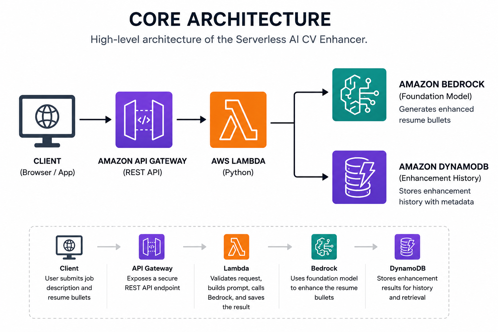
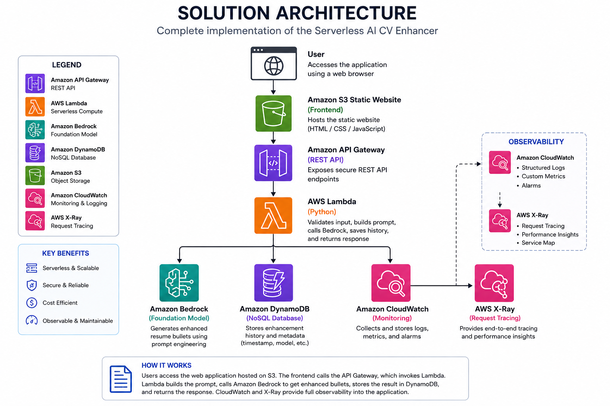
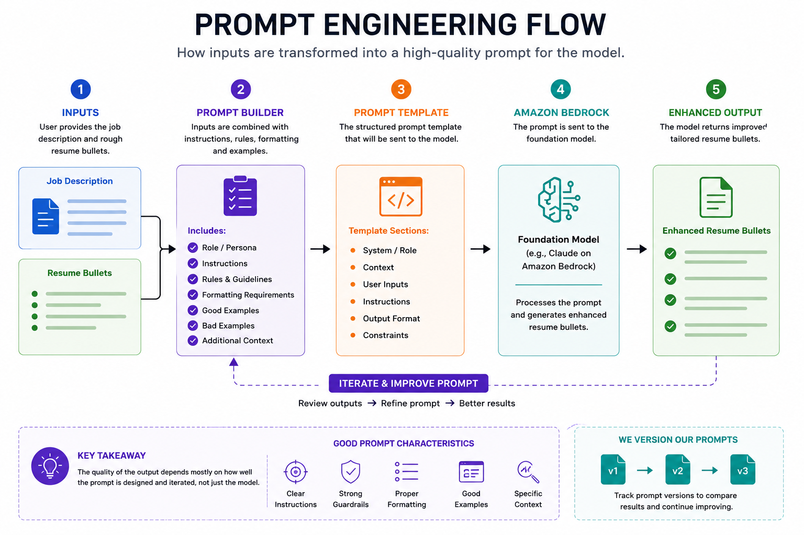

# 🚀 Serverless AI CV Enhancer

A serverless Generative AI application that improves genuine resume bullet points based on a target job description using Amazon Bedrock.

---

## 📌 Project Overview

The Serverless AI CV Enhancer accepts two inputs:

* A target job description
* A set of genuine but unpolished resume bullet points

The application sends both inputs to an Amazon Bedrock foundation model using a carefully designed prompt.

The model returns stronger resume bullets that are:

* Clearer
* More professional
* Better aligned with the target role
* Written using stronger action verbs
* Quantified only when the user provides supporting information

The application is designed to improve the presentation of genuine experience without inventing responsibilities, technologies, achievements, or unsupported metrics.

---

## 🙏 Project Inspiration

This project is inspired by a Serverless AI CV Enhancer idea shared by **Lefteris Karageorgiou**.

The original idea demonstrates how a useful Generative AI application can be built using four managed AWS services:

* Amazon API Gateway
* AWS Lambda
* Amazon Bedrock
* Amazon DynamoDB

This repository documents my own implementation, experiments, architectural decisions, troubleshooting experience, and learning journey while building the application from the beginning.

---

## 💡 Why This Project

This project is useful because it solves a practical problem.

Many professionals have valuable experience but struggle to describe that experience clearly on their resumes. Their original resume bullets may be honest but too simple, unclear, or poorly aligned with a job description.

For example:

```text
Worked on Dynatrace dashboards
```

The application may improve it to:

```text
Developed Dynatrace dashboards to improve application health visibility and support faster production incident investigation.
```

The goal is not to change the candidate's experience.

The goal is to communicate the same genuine experience more clearly and professionally.

---

## 🎯 Learning Objectives

This project will help me understand how to:

* Build a serverless REST API using Amazon API Gateway
* Develop and test Python applications using AWS Lambda
* Integrate a foundation model using Amazon Bedrock
* Design and improve Generative AI prompts
* Validate API requests
* Handle Bedrock responses and errors
* Store enhancement history using Amazon DynamoDB
* Query previous enhancements by date
* Apply least-privilege IAM permissions
* Add structured logging using Amazon CloudWatch
* Add request tracing
* Build a simple static frontend
* Implement optional streaming responses
* Explain architectural decisions during interviews

---

## 🏗️ Core Architecture


The project uses managed, serverless AWS services.

There are:

* No EC2 instances
* No containers
* No always-running servers
* No operating systems to patch
* No infrastructure running while the application is unused

---

## ☁️ AWS Services

| AWS Service        | Purpose                                         | Status  |
| ------------------ | ----------------------------------------------- | ------- |
| Amazon API Gateway | Expose the application API                      | Planned |
| AWS Lambda         | Validate requests and run the application logic | In Progress |
| Amazon Bedrock     | Enhance resume bullets using a foundation model | Planned |
| Amazon DynamoDB    | Store and retrieve enhancement history          | Planned |
| Amazon CloudWatch  | Store logs and application metrics              | Planned |
| AWS X-Ray          | Trace requests across the application           | Planned |
| AWS IAM            | Control service permissions                     | Planned |
| Amazon S3          | Host the static frontend                        | Planned |

---

## 🔄 Application Workflow


---

## 🏛️ Solution Architecture

The following diagram illustrates the complete implementation of the Serverless AI CV Enhancer after all planned features have been implemented.

It includes:

- Amazon S3 static website
- Amazon API Gateway
- AWS Lambda
- Amazon Bedrock
- Amazon DynamoDB
- Amazon CloudWatch
- AWS X-Ray




---

## 🧠 Prompt Engineering Flow

The quality of this application depends heavily on how the prompt is constructed before calling Amazon Bedrock.

Rather than sending the user's resume directly to the model, AWS Lambda combines:

- Target job description
- Resume bullets
- Prompt template
- Prompt instructions

The following diagram illustrates this process.



---

## 🧠 The Prompt Is the Product

The AWS infrastructure is important, but the quality of the application mainly depends on the prompt sent to the foundation model.

The prompt should instruct the model to:

* Act as an experienced resume writer
* Use strong action verbs
* Tailor the bullets to the target job description
* Improve clarity and professionalism
* Preserve the user's original meaning
* Avoid inventing experience
* Avoid creating unsupported numbers or percentages
* Return clean and structured output

The prompt will be improved and versioned throughout the project.

Example:

```text
resume-enhancer-v1.txt
resume-enhancer-v2.txt
resume-enhancer-v3.txt
```

Each generated result may store the prompt version used so that different prompt versions can be compared.

---

## 📥 Example Input

```json
{
  "jobDescription": "We are looking for a Cloud Engineer with experience in AWS, infrastructure automation, observability, incident troubleshooting and production support.",
  "resumeBullets": [
    "Worked on Dynatrace dashboards",
    "Helped application teams troubleshoot production incidents",
    "Used Ansible to deploy and configure Dynatrace OneAgent"
  ]
}
```

---

## 📤 Example Output

```json
{
  "enhancedBullets": [
    "Developed Dynatrace dashboards to improve visibility into application health and production performance.",
    "Supported application teams with production incident troubleshooting and root cause investigation.",
    "Automated Dynatrace OneAgent deployment and configuration using Ansible."
  ],
  "promptVersion": "v1",
  "modelId": "configured-bedrock-model",
  "createdAt": "2026-08-05T23:30:00Z"
}
```

The final output format may change as the project develops.

---

## ✨ Planned Features

### Core Features

* Submit a target job description
* Submit genuine resume bullets
* Validate the incoming request
* Enhance resume bullets using Amazon Bedrock
* Return structured output
* Store enhancement history in DynamoDB
* Retrieve previous enhancements

### Level-Up Features

* One-page static frontend
* Copy enhanced bullets
* Query enhancement history by date
* Structured CloudWatch logging
* Request IDs
* Bedrock response-time tracking
* AWS X-Ray tracing
* Prompt version tracking
* Model version tracking
* Optional streaming responses

---

## 🗃️ DynamoDB History

Amazon DynamoDB will store previous resume enhancements.

A possible item structure is:

```text
Partition Key: USER#demo
Sort Key: ENHANCEMENT#2026-08-05T23:30:00Z
```

Possible attributes:

```text
jobDescription
originalBullets
enhancedBullets
promptVersion
modelId
createdAt
requestId
```

This design supports retrieving a user's previous enhancements in date order.

Authentication is not part of the initial version, so the project may use a fixed demo user during early development.

---

## 📊 Observability

The project will include production-minded observability without making the architecture unnecessarily complex.

Planned logging fields:

```text
requestId
operation
status
durationMs
modelId
promptVersion
errorType
createdAt
```

Example structured log:

```json
{
  "requestId": "12345",
  "operation": "enhanceResume",
  "status": "SUCCESS",
  "durationMs": 2450,
  "promptVersion": "v1"
}
```

The application will avoid writing complete resumes or job descriptions into logs because they may contain personal information.

---

## 🌐 Frontend

A simple one-page frontend will be added after the backend API works.

The frontend will use:

* HTML
* CSS
* JavaScript
* Amazon S3 static website hosting

The page will allow users to:

* Paste a job description
* Enter resume bullets
* Submit the request
* View enhanced bullets
* Copy the result
* View previous enhancements

A frontend framework is not required because the main learning goal is AWS serverless architecture and Generative AI integration.

---

## 🌊 Optional Streaming Responses

The initial version will return the complete Bedrock response after generation is finished.

After the base application is stable, streaming may be explored so enhanced bullets appear gradually instead of waiting for the full response.

```text
Initial version:

Request
   |
   v
Complete Bedrock response
   |
   v
Display result
```

```text
Optional streaming version:

Request
   |
   v
Partial Bedrock responses
   |
   v
Display output gradually
```

Streaming is an advanced enhancement and is not required for the first working version.

---

## 📂 Repository Structure

```text
aws-serverless-ai-cv-enhancer/
├── architecture/
│   ├── diagrams/
│   │   ├── 01-core-architecture.png
│   │   ├── 02-application-workflow.png
│   │   ├── 03-prompt-engineering-flow.png
│   │   └── 04-solution-architecture.png
│   └── decisions/
├── docs/
├── frontend/
├── lambda/
├── policies/
├── prompts/
├── sample-events/
├── screenshots/
├── .gitignore
└── README.md
```

### Folder Purpose

| Folder           | Purpose                               |
| ---------------- | ------------------------------------- |
| `architecture/diagrams` | AWS architecture and workflow diagrams |
| `architecture/decisions` | Architecture Decision Records (ADRs) |
| `docs/`          | Phase-by-phase implementation notes   |
| `frontend/`      | Static web interface                  |
| `lambda/`        | Python Lambda application code        |
| `policies/`      | IAM policies used by the project      |
| `prompts/`       | Prompt versions and prompt test cases |
| `sample-events/` | JSON requests used for testing        |
| `screenshots/`   | Screenshots of completed features     |

---

## 🗺️ Implementation Roadmap

### Phase 1: Project Foundation

* Create the project structure
* Create the README
* Add a sample API request
* Define the initial scope
* Document cost-conscious decisions

### Phase 2: Basic Lambda Request Handling

* Create a Python Lambda handler
* Read the incoming request
* Understand Lambda event and response formats
* Return a temporary response

### Phase 3: Input Validation

* Validate the job description
* Validate the resume bullets
* Handle missing or invalid fields
* Return meaningful HTTP errors

### Phase 4: Amazon Bedrock Prompt Testing

* Enable access to a foundation model
* Create the initial resume-enhancement prompt
* Test the prompt with realistic examples
* Improve the prompt based on output quality

### Phase 5: Lambda and Bedrock Integration

* Add the AWS SDK call
* Send the prompt to Amazon Bedrock
* Parse the model response
* Handle Bedrock errors and timeouts

### Phase 6: API Gateway Integration

* Create the API endpoint
* Connect API Gateway to Lambda
* Test the API using Postman or `curl`
* Configure CORS

### Phase 7: DynamoDB History

* Create the DynamoDB table
* Store original and enhanced bullets
* Store timestamps, prompt versions, and model details
* Test write operations

### Phase 8: Query History by Date

* Define DynamoDB access patterns
* Retrieve previous enhancements
* Sort enhancements by date
* Return history through the API

### Phase 9: Simple Static Frontend

* Create the HTML page
* Add CSS styling
* Add JavaScript API calls
* Host the frontend using Amazon S3

### Phase 10: Observability

* Add structured CloudWatch logs
* Add request IDs
* Track application duration
* Track Bedrock errors
* Add request tracing

### Phase 11: Security and Error Handling

* Apply least-privilege IAM policies
* Validate input size
* Avoid logging sensitive content
* Add API throttling where appropriate
* Improve user-friendly error messages

### Phase 12: Testing and Cleanup

* Add valid and invalid test cases
* Test common failure scenarios
* Review AWS resource costs
* Create a cleanup guide
* Update project documentation

### Phase 13: Optional Streaming Responses

* Explore Bedrock streaming
* Update the backend flow
* Display partial responses in the frontend
* Compare the user experience with the normal response flow


---

## 💰 Cost-Conscious Decisions

To keep the project affordable and beginner-friendly:

* Route 53 will not be used
* A custom domain will not be purchased
* The default API Gateway endpoint will be used
* The frontend will use an S3-provided URL
* Terraform will be introduced only after the manual implementation is understood
* AWS resources will be removed when they are no longer required
* The project will use serverless and pay-per-use AWS services
* Bedrock testing will use small inputs and controlled output limits

Serverless does not mean completely free. Amazon Bedrock model usage and other AWS services may still create charges.

---

## 🔐 Security Principles

The project will follow these basic security practices:

* Use IAM roles instead of hard-coded AWS credentials
* Follow least-privilege permissions
* Do not commit secrets to GitHub
* Validate all incoming API input
* Limit input and output sizes
* Avoid storing unnecessary personal information
* Avoid logging full resumes and job descriptions
* Enable encryption using AWS-managed service encryption
* Remove unused AWS resources after testing

---

## ⚠️ Responsible Use

The application should improve how genuine experience is communicated.

It should not generate:

* Fake employment experience
* Skills the user does not possess
* Unsupported percentages or numbers
* Responsibilities the user did not perform
* Misleading achievements
* Technologies that were not actually used

The prompt will explicitly instruct the model not to invent facts.

When measurable information is not provided, the model should improve the wording without creating numbers.

---

## 🚧 Project Status

### Completed

- Project foundation completed
- Basic Lambda handler created
- API Gateway event simulated locally
- Request body parsing implemented
- Input validation implemented
- Invalid request handling implemented
- Local validation tests completed

### Current Phase

```text
Phase 3: Input Validation
```

### Next Phase

```text
Phase 4: Amazon Bedrock Prompt Testing
```

---

## 🧹 Cleanup

A cleanup guide will be added before the project is considered complete.

The guide will explain how to remove:

* API Gateway APIs
* Lambda functions
* DynamoDB tables
* S3 buckets
* CloudWatch log groups
* IAM roles and policies
* Any Bedrock-related test resources

This helps prevent unnecessary AWS charges after testing.

---

## 🎯 What This Project Demonstrates

By completing this project, I will demonstrate the ability to:

- Design and build a serverless application on AWS
- Integrate Amazon Bedrock into a real-world application
- Apply prompt engineering techniques
- Build REST APIs using Amazon API Gateway and AWS Lambda
- Design DynamoDB access patterns
- Apply AWS security best practices
- Implement structured logging and request tracing
- Deliver a complete end-to-end cloud application

---

## 📚 Key Takeaway

This project demonstrates that building a useful Generative AI application is not only about connecting an application to a foundation model.

The quality of the final result depends on:

* Clear application requirements
* Good prompt design
* Honest input data
* Secure AWS integration
* Reliable error handling
* Useful history storage
* Observability
* A simple user experience

The main goal is to build a small but complete serverless Generative AI application and understand every step of its implementation.
