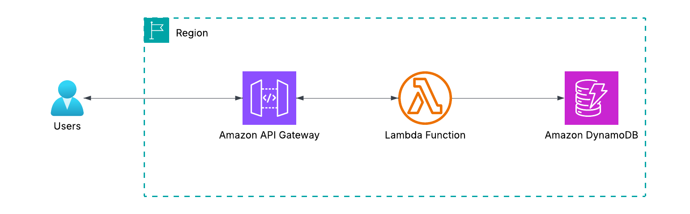
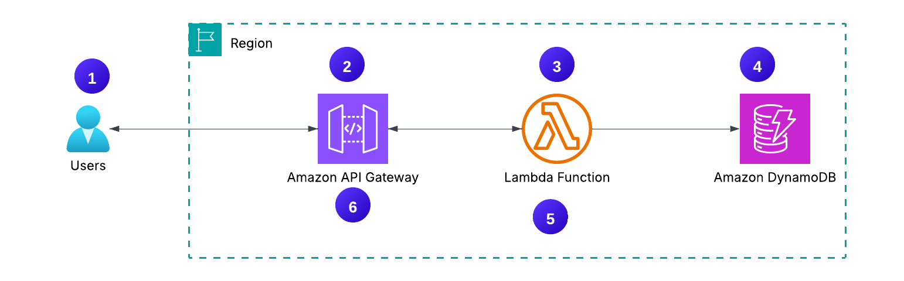

# 🏗 Architecture

This document provides a simple, beginner‑friendly overview of the architecture used in this project.
The goal is to clearly explain how the system works, which AWS services are involved, and why this design is ideal for learning cloud fundamentals.

---

## 🧭 Architecture Overview

The project implements a serverless CRUD API using three core AWS services:

- **Amazon API Gateway** — exposes an HTTPS endpoint
- **AWS Lambda** — runs backend logic without servers
- **Amazon DynamoDB** — stores and retrieves data

When a client sends a POST request, API Gateway forwards it to a Lambda function.
The Lambda function reads the operation field from the request and performs the corresponding action on DynamoDB.

This design is lightweight, scalable, and cost‑efficient — perfect for learning how serverless applications work on AWS.

---

## 🏛 Architecture

Below is a simplified view of how the components interact

---

## ☁️ AWS Services Used

- **Amazon API Gateway** - Handles HTTPS requests
- **AWS Lambda** - Executes backend logic
- **Amazon DynamoDB** - Stores items
- **AWS IAM** - Provides least‑privilege access
- **Amazon Cloud Watch** - Stores Lamdba Logs

---

## 🔁 End‑to‑End Flow

Here’s how a user request moves through the system:

1. Client sends POST request  2. API Gateway receives the request  
3. Lambda executes the operation 
4. DynamoDB processes the request
5. Lambda returns the result
6. API Gateway responds to the client  

---

## ⭐ Key Architecture Benefits

- **Fully Serverless**
    - No servers, no patching, no scaling headaches.  
- **Extremely Cost‑Efficient**
    - You only pay when:
        - Lambda runs
        - API Gateway receives a request
        - DynamoDB stores data
- **Highly Scalable**
    - AWS automatically handles:
        - Traffic spikes
        - Concurrency
        - Throughput
- **Easy to Extend** 
    - You can add:
        - Authentication (Cognito)
        - More operations
        - Additional Lambda functions

---
