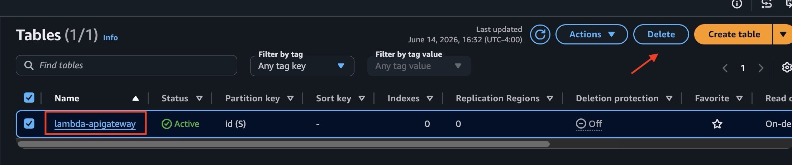
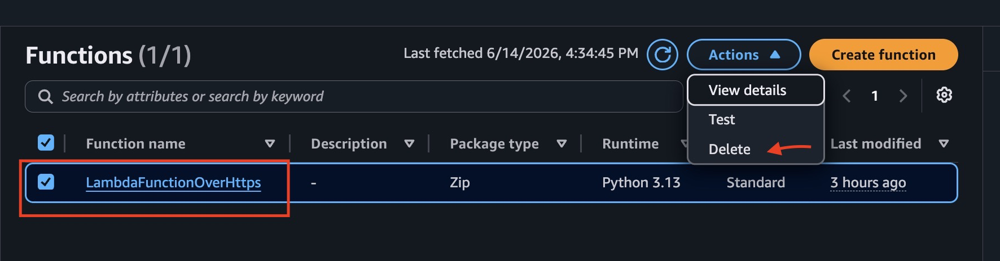
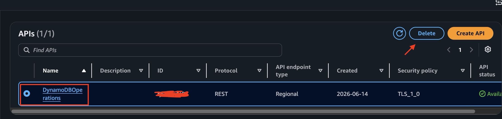
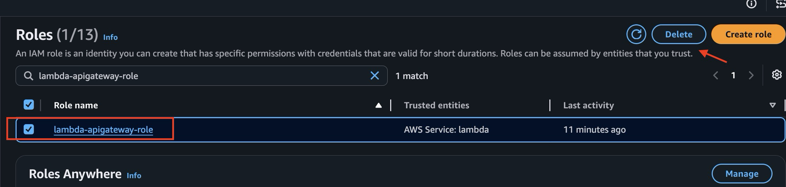
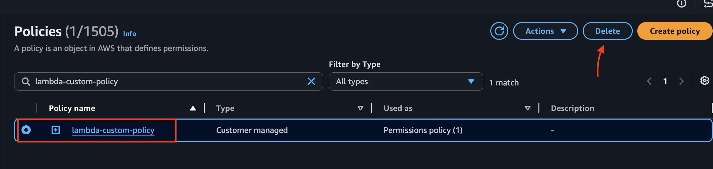

# 🧹 Cleanup Guide  
This guide helps you safely remove all AWS resources created during the deployment of the **Serverless CRUD API**.  
Following these steps ensures you avoid unnecessary AWS charges.

---

## 🗑 1. Delete DynamoDB Table

1. Open the **DynamoDB** service in the AWS Console.  
2. Select the table **`lambda-apigateway`**.  
3. Click **Actions → Delete table**.  

4. Confirm the deletion.

This removes all stored items and the table itself.

---

## 🗑 2. Delete Lambda Function

1. Open the **Lambda** service.  
2. Select the function **`LambdaFunctionOverHttps`**.  
3. Click **Actions → Delete**.  

4. Confirm deletion.

This removes the compute resource used by your API.

---

## 🗑 3. Delete API Gateway REST API

1. Open **API Gateway** in the AWS Console.  
2. Under **APIs**, select **`DynamoDBOperations`**.  
3. Click **Actions → Delete API**.  

4. Confirm deletion.

This removes the REST API endpoint and all associated stages.

---

## 🗑 4. Delete IAM Role and Policy

### 🔸 Delete IAM Role
1. Open **IAM → Roles**.  
2. Search for **`lambda-apigateway-role`**.  
3. Select it and click **Delete**.

### 🔸 Delete IAM Policy
1. Open **IAM → Policies**.  
2. Search for **`lambda-custom-policy`**.  
3. Select it and click **Delete**.

This ensures no unused permissions remain in your account.

---

## 🧼 Cleanup Complete

All AWS resources created for this project have now been removed.  
Your account will no longer incur charges related to this Serverless CRUD API.🎉
