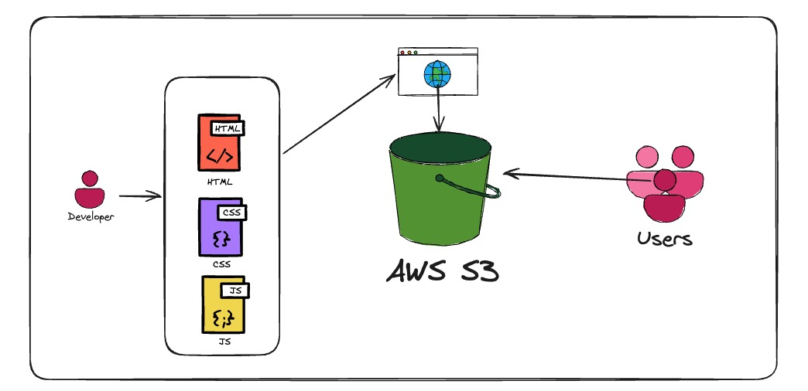

# 🌟 AWS Static Website Hosting Project

This project is part of my hands‑on learning journey into AWS and cloud engineering.  
As a beginner strengthening my cloud fundamentals, I wanted to build something simple, practical, and real — a fully working static website hosted on Amazon S3.

My goal wasn’t just to “make it work,” but to understand *how* cloud services fit together and to document my learning the way real engineering teams do.  
That’s why this repository includes a clear folder structure, architecture notes, ADRs, and deployment steps — all written from a beginner’s perspective but with professional habits in mind.

---

## 🚀 Project Overview

This project demonstrates:

- Hosting a static website using **Amazon S3**
- Understanding AWS fundamentals through hands‑on practice
- Documenting architecture and decisions clearly
- Using a clean, professional project structure
- Linking to a separate repo for the website source code

The actual website files live in a separate repository:

👉 **Website Source Code:** https://github.com/bajibpathan/aws-ai-cloud-match-game

---

## 🏗 Architecture

This project uses one of the simplest AWS architectures:

**User → S3 Static Website Hosting**

- **Amazon S3** stores and serves the static files (HTML, CSS, JS)
- The bucket is configured for **static website hosting**
- A public website endpoint is generated by S3
- Users access the site directly through that endpoint

A simple architecture diagram is below:



---

## 📦 Folder Structure

```text
.
├── docs/
│   ├── architecture/      # Simple architecture explanation + diagram
│   ├── deployment/        # Step-by-step deployment guide
│   ├── diagrams/          # Visual diagrams (architecture, flow, structure)
│   ├── adr/               # Architecture Decision Records
│   └── references/        # Learning resources used for this project
│
├── src/                   # Placeholder; source code lives in separate repo
│
├── scripts/               # Placeholder for future automation scripts
│
├── tests/                 # Placeholder for future tests
│
└── README.md              # Main project documentation

```


Each folder includes a minimal README explaining its purpose.

---

## 📄 Deployment Guide

A complete, beginner‑friendly deployment guide is available here:

👉 [Deployment Guide](docs/deployment/deployment-guide.md)


It includes:

- Creating an S3 bucket  
- Enabling static website hosting  
- Configuring public access (learning only)  
- Adding a bucket policy  
- Uploading website files  
- Accessing the live website  

---
## 🧼 Clean‑up Instructions

If you no longer want this project hosted on AWS, you can safely remove all resources to avoid unexpected charges.

A full clean‑up guide is available here:

👉 [Clean‑up Instructions](docs/deployment/cleanup.md)

---

## 🧩 Architecture Decision Records (ADRs)

ADRs help document *why* certain choices were made.

Examples included:

- **ADR 001:** Use Amazon S3 for hosting  
- **ADR 002:** Keep website code in a separate repo  
- **ADR 003:** Include placeholder folders for future learning  

All ADRs are stored in:

👉 [ADR](docs/adr/README.md)

---

## 📚 References

A list of AWS docs, tutorials, and tools that helped me learn is available in:

👉 [References](docs/references/README.md)


---

## 🎯 Why This Project Matters

This project reflects the way I approach cloud learning:

- Build something real  
- Understand it deeply  
- Document it clearly  
- Improve it over time  

It also demonstrates foundational AWS skills that are essential for cloud engineering roles.


---

## 🙌 Final Note

This repository is intentionally simple — but structured professionally.  
It reflects my learning journey into AWS and shows how I approach cloud engineering:

- build something real  
- understand it clearly  
- document it properly  

As I continue improving my cloud skills, I will refine and enhance this project over time.

--- 

## ⭐ Support
If you find these projects helpful or inspiring, feel free to star the repository.